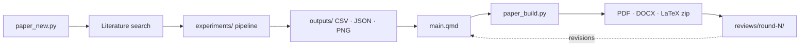

# Research

[](https://github.com/lisk0vian/research/actions/workflows/validate.yml)


[](./LICENSE)
[](./LICENSE-CONTENT)

Reproducible research papers: one folder per paper holding the manuscript, the
pipeline that produces its numbers, the results and the reviewer rounds — all
built, validated and tested the same way.

- **One source per manuscript.** `paper/main.qmd` renders to the journal's PDF,
  Word and LaTeX submission zip. Derived files are never edited by hand.
- **Every number traces to a file.** Figures and tables come from
  `outputs/` (CSV/JSON), produced by the code in `experiments/`.
- **Enforced, not just documented.** CI runs `scripts/paper_validate.py` and
  `pytest` on every pull request.

> [!NOTE]
> [`AGENTS.md`](./AGENTS.md) is the full specification (layout, manifest
> contract, validation rules). This README is the practical entry point.

---

## Contents

- [Papers](#papers)
- [Getting started](#getting-started)
- [Everyday workflow](#everyday-workflow)
- [Repository layout](#repository-layout)
- [Command reference](#command-reference)
- [AI agent skills](#ai-agent-skills)
- [Contributing](#contributing)
- [License](#license)

---

## Papers

| Code | Title | Target journal | Status |
|---|---|---|---|
| [`C15-2026`](./papers/c15-2026/) | A Reproducible Methodological Framework for Prosecutorial Congestion Risk Prediction | *Machine Learning with Applications* | `Revision` |
| [`C20-2026`](./papers/c20-2026/) | Subseasonal Temperature Forecasting in Andean Stations: A Benchmark of ML and DL Models with Anomaly Decomposition | *Engineering Applications of Artificial Intelligence* | `In Progress` |
| [`C21-2026`](./papers/c21-2026/) | Temporal Validation of Low Birth Weight Classification in a National Peruvian Birth Registry (2015–2025) | *Discover Artificial Intelligence* | `Revision` |
| [`C26-2026`](./papers/c26-2026/) | A Reproducible GeoAI Framework for Explainable Spatiotemporal Analysis of National Missing-Person Registers | *Information Sciences* | `In Progress` |

**Legacy (frozen, pre-standardization):**
[`C25-202620-violence/`](./C25-202620-violence/) — violence analysis, early stage.

<details>
<summary>Status legend</summary>

| Status | Meaning |
|---|---|
| `Planning` | Proposed or being prepared |
| `In Progress` | Being developed |
| `Under Review` | Submitted, awaiting decision |
| `Revision` | Being corrected after reviewer feedback |
| `Resubmitted` | Revised and resubmitted |
| `Accepted` | Accepted for publication |
| `Published` | Officially published |
| `Completed` | Finished (may be unpublished) |

</details>

---

## Getting started

### Requirements

| Tool | Needed for |
|---|---|
| Python 3.12 + `requirements-dev.txt` | scripts, validation, tests |
| [Quarto](https://quarto.org) | rendering manuscripts |
| A LaTeX distribution (TinyTeX, TeX Live, MiKTeX) | PDF output |
| Microsoft Word or LibreOffice *(optional)* | DOCX ↔ PDF parity checks |

### Setup

```bash
git clone git@github.com:lisk0vian/research.git
cd research
pip install -r requirements-dev.txt

# Verify the environment for a paper (reports what is missing, installs nothing)
python scripts/paper_build.py --slug c15-2026 --check-only

# Sanity check: structure + fast test suite
python scripts/paper_validate.py
pytest -m "not slow" -q
```

<details>
<summary>Optional one-time setup per machine</summary>

```bash
# STIX fonts (shipped with TeX) so Word shows the DOCX in the same typeface
# as the PDF. Without them Word falls back to Times New Roman.
powershell -ExecutionPolicy Bypass -File scripts/install_stix_fonts.ps1

# OpenCode: generate opencode.jsonc for the MCP servers (holds absolute paths)
python scripts/setup_mcp.py

# Claude Code: register the same MCP servers (kept in ~/.claude.json, not in the repo)
python scripts/setup_mcp.py --claude
```

Claude Code skill links are created automatically by a `SessionStart` hook;
run `python scripts/link_skills.py` to refresh them by hand.

</details>

---

## Everyday workflow



**1. Create a paper**

```bash
python scripts/paper_new.py --slug c22-2026 --title "My paper" \
    --journal machine-learning-with-applications \
    --author moises:corresponding:1 --author jeremi:author:2
```

Slugs are lowercase: the institutional code (`C22-2026` → `c22-2026`) or a short
kebab-case topic (`carrion-clustering`). Authors must exist in
[`authors/`](./authors/) and the journal in [`templates/journals/`](./templates/journals/).

**2. Produce the results** — pipeline code in `experiments/` writes to `outputs/`.

**3. Write and build**

```bash
python scripts/paper_build.py --slug c22-2026 --format all
# -> papers/c22-2026/build/c22-2026.pdf, .docx, -latex.zip
```

**4. Retarget a journal** (rewrites the manifest and the `main.qmd` format block)

```bash
python scripts/paper_journal.py --slug c22-2026 --journal information-sciences
```

**5. Validate before pushing**

```bash
python scripts/paper_validate.py && pytest -m "not slow" -q
```

---

## Repository layout

```
research/
├── papers/<slug>/          # one standardized folder per paper (below)
├── authors/                # one YAML per person, referenced by id
├── templates/
│   ├── paper/              # seed files for paper_new.py
│   └── journals/<slug>/    # journal metadata + Quarto extension
├── scripts/                # automation (plain Python)
├── tests/                  # structure and script tests
└── .agents/skills/         # AI agent skills (OpenCode / Claude Code)
```

Every paper has the same shape:

```
papers/<slug>/
├── manifest.yaml   # title, journal, authors (by id), claims, figures
├── paper/          # SOURCES ONLY: main.qmd, references.bib, media/
├── data/           # raw + processed (large/sensitive files stay out of git)
├── experiments/    # pipeline code that produces the numbers
├── notebooks/      # exploratory notebooks
├── outputs/        # machine-readable results (CSV/JSON/PNG/PKL)
├── tests/          # optional synthetic-fixture test suite
├── reviews/        # round-N/: comments, responses, ai-review
├── build/          # rendered outputs (only the PDF is committed)
└── legacy/         # original .docx/.pdf when migrating a paper
```

**Supported journals:**

| Slug | Journal | Publisher |
|---|---|---|
| `machine-learning-with-applications` | Machine Learning with Applications | Elsevier |
| `engineering-applications-of-artificial-intelligence` | Engineering Applications of Artificial Intelligence | Elsevier |
| `information-sciences` | Information Sciences | Elsevier |
| `discover-artificial-intelligence` | Discover Artificial Intelligence | Springer Nature |

Add one from its website with `python scripts/paper_journal.py --add-journal <slug> --meta meta.json`.

---

## Command reference

| Task | Command |
|---|---|
| Create a paper | `python scripts/paper_new.py --slug <slug> --journal <journal> --author id:role:order ...` |
| Build PDF, DOCX and LaTeX zip | `python scripts/paper_build.py --slug <slug> --format all` |
| Check the build environment | `python scripts/paper_build.py --slug <slug> --check-only` |
| Change journal | `python scripts/paper_journal.py --slug <slug> --journal <journal>` |
| Add a journal | `python scripts/paper_journal.py --add-journal <slug> --meta meta.json` |
| DOCX / LaTeX-zip vs PDF parity | `python scripts/paper_parity.py --slug <slug>` |
| Elsevier CAS template fidelity | `python scripts/cas_fidelity.py` (`--docx` for Word) |
| Validate the repository | `python scripts/paper_validate.py` |
| Sparse-clone one paper (Colab) | `python scripts/paper_sparse_clone.py --slug <slug> --dest <dir>` |
| Sync a paper's Drive folder | `python scripts/paper_drive_sync.py --slug <slug>` |
| Fast tests (CI gate) | `pytest -m "not slow" -q` |
| Full test suite | `pytest -q` |

> [!IMPORTANT]
> Colab notebooks on Drive are always updated **in place** (`fileId`), never
> recreated — see [AGENTS.md §3](./AGENTS.md#3-workflow-and-commands).

---

## AI agent skills

The skills in [`.agents/skills/`](./.agents/skills/) wrap the scripts above for
AI coding agents. **OpenCode** reads them directly; **Claude Code** gets them
through links in `.claude/skills/` created automatically on session start.

| Skill | Purpose |
|---|---|
| `paper-new` | Scaffold a paper |
| `paper-build` | Render PDF / DOCX |
| `paper-journal` | Set or change the journal |
| `paper-validate` | Validate the structure and explain errors |
| `paper-search` | Literature search, citation verification, BibTeX |
| `paper-humanize` | Rewrite AI-drafted prose into natural academic writing |
| `util-docx` · `util-office-to-md` · `util-search` | Word files, Office → Markdown, content search |
| `grilling` | Stress-test a plan before committing to it |

---

## Contributing

1. Branch from `main`; keep all content in English.
2. Change only sources — `main.qmd`, `experiments/`, manifests — never derived files.
3. Run `python scripts/paper_validate.py && pytest -q` locally (the `slow`
   suites are skipped in CI but must still pass before a release).
4. Open a pull request. The [`validate`](./.github/workflows/validate.yml)
   workflow runs on any change to `papers/`, `authors/`, `templates/`,
   `scripts/`, `tests/` or `.agents/skills/`.

---

## License

- **Code** — [MIT](./LICENSE)
- **Research content** (manuscripts, figures, results) — [CC BY 4.0](./LICENSE-CONTENT)
- Third-party datasets, libraries and publications keep their own licenses.
