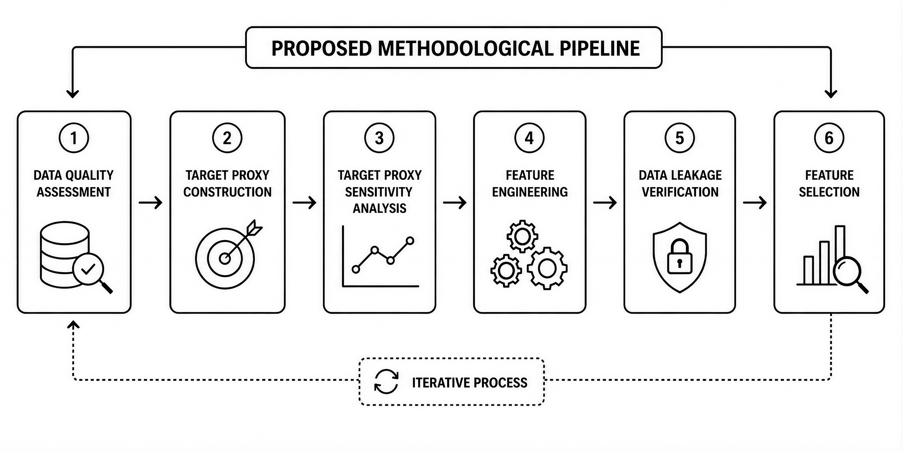
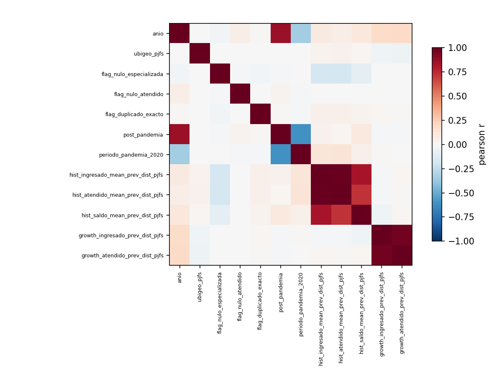
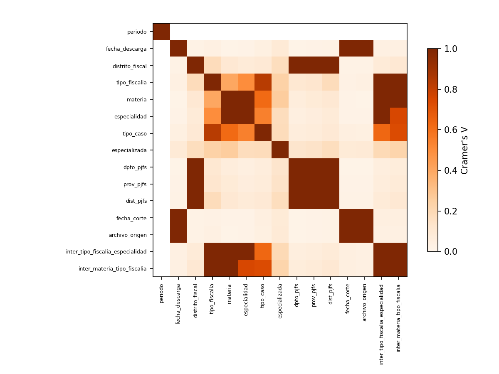
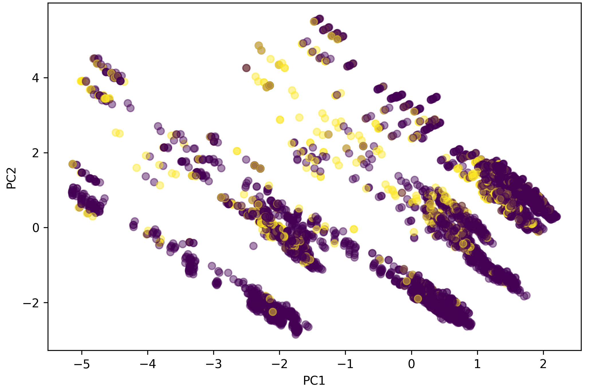
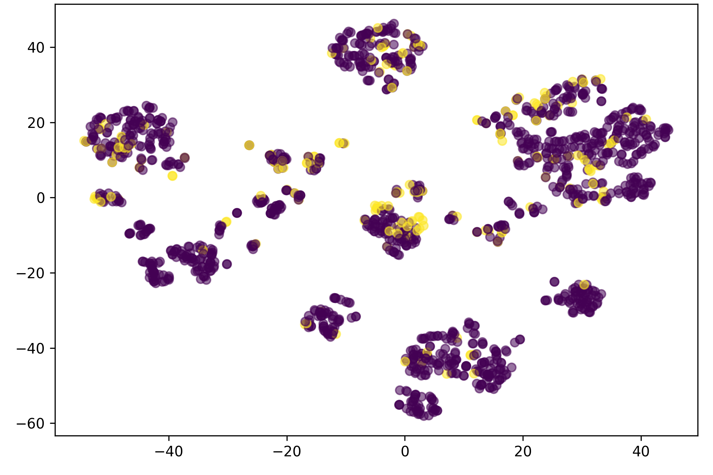
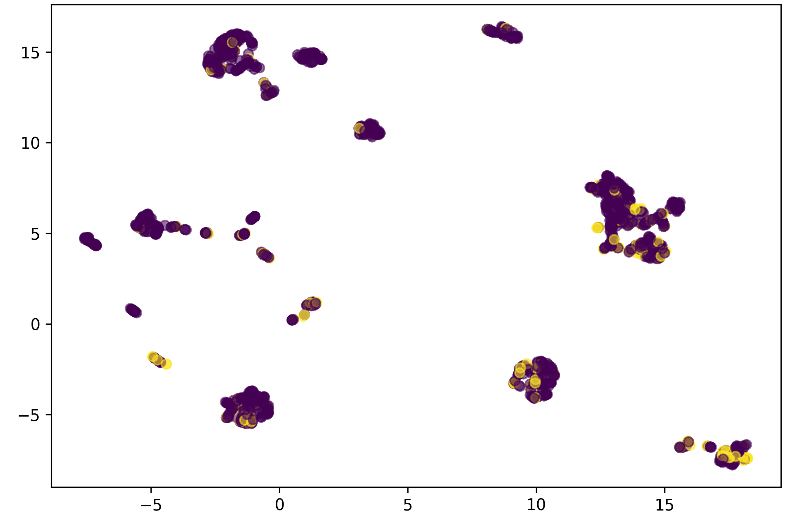
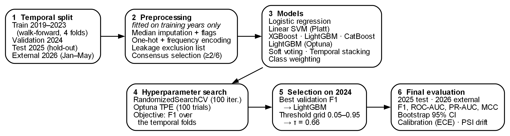
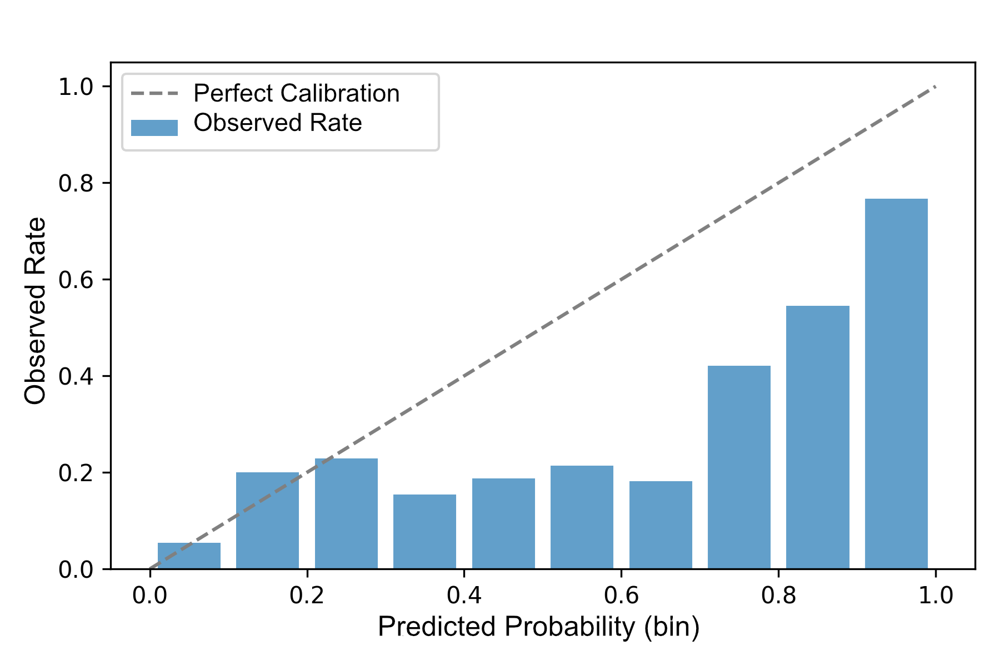
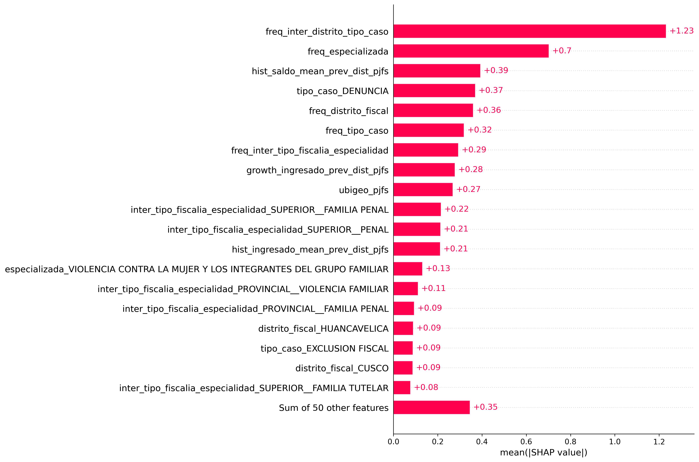
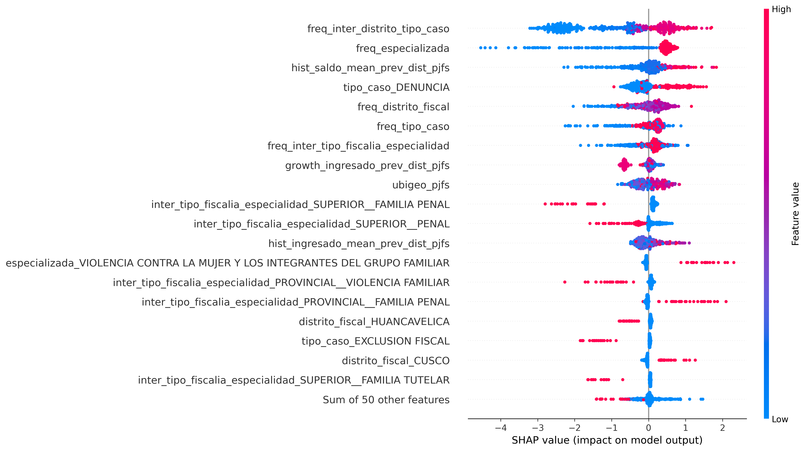

---
# papers/c15-2026/paper/main.qmd
# Single source of the manuscript. Render with:
#   python scripts/paper_build.py --slug c15-2026 --format all
# journal.formatting: doubleblind -> build/c15-2026.pdf/.docx are the
# anonymized manuscript, and build/c15-2026-title-page.docx/.pdf carry the
# identifying data (built from the author/affiliations blocks below).
title: "A Reproducible Methodological Framework for Prosecutorial Congestion Risk Prediction Using Explainable Machine Learning and Temporal Validation"
format:
  elsevier-cas-pdf: {}
  elsevier-cas-docx: {}
# journal.* lives at the top level (not under a single format) so that BOTH
# targets see it: the PDF template reads $journal.*$, and cas-docx.lua builds
# the Word front matter (highlights, corresponding/author notes) from it.
journal:
  name: "Machine Learning with Applications"
  issn: 2666-8270
  publisher: "Elsevier"
  short-title: "Prosecutorial congestion risk with explainable machine learning"
  cite-style: authoryear
  # Anonymized manuscript + separate title page, as requested for this
  # submission (the journal itself runs single anonymized review).
  formatting: doubleblind
  corresponding:
    - mark: cor1
      text: "Corresponding author"
  # Journal guideline: 3-5 highlights of at most 85 characters.
  # TODO: review the wording with the authors before submission.
  highlights:
    - "Consensus of six feature selectors keeps 69 of 433 encoded features"
    - "Year-block temporal validation keeps 2025 and 2026 out of model selection"
    - "LightGBM reaches F1 0.469 and ROC-AUC 0.798 on the 2025 hold-out test set"
    - "Ablation and SHAP agree that territorial-institutional patterns drive risk"
author:
  - name: Moisés Evangelista Gamarra
    email: mevangelistag@senati.pe
    orcid: "0009-0002-5382-1390"
    affiliation: [{ref: aff-1}]
    cas:
      cormark: 1
  - name: Jerremi Aron Chancan Labajos
    email: 1520481@senati.pe
    orcid: "0009-0005-6789-076X"
    affiliation: [{ref: aff-1}]
affiliations:
  - id: aff-1
    name: Servicio Nacional de Adiestramiento en Trabajo Industrial (SENATI)
    # TODO: confirm the postal address of the authors' SENATI campus.
    address: Av. Alfredo Mendiola 3520, Independencia
    postal-code: "15311"
    city: Lima
    country: Peru
# Title-page-only statements: Elsevier's double-anonymized guidelines take
# them out of the manuscript and put them on the separate title page.
# TODO: the authors confirm both statements before submission.
title-page:
  funding: "This work was supported by the Servicio Nacional de Adiestramiento en Trabajo Industrial (SENATI)."
  competing-interests: "The authors declare that they have no known competing financial interests or personal relationships that could have appeared to influence the work reported in this paper."
abstract: |
  Congestion in justice systems poses a significant challenge for institutional planning due to its impact on operational workload and resource allocation. This study proposes a reproducible machine learning framework to estimate the proxy risk of prosecutorial congestion using administrative records from the Public Prosecutor's Office of Peru covering the 2019--2026 period. The methodology integrates consensus-based robust feature selection, temporal validation to prevent data leakage, robustness assessment, ablation analysis, and SHAP-based interpretability within a single reproducible workflow. The selected model achieved an F1-score of 0.469 and a ROC-AUC of 0.798 on the 2025 test set while maintaining consistent performance during external temporal validation on the 2026 dataset. The ablation study and SHAP analysis indicate that the model's predictive capability is driven primarily by territorial and institutional patterns, whereas historical features provide complementary information. Furthermore, the operational impact analysis highlights the model's potential to support the preventive prioritization of operational combinations with higher estimated proxy risk. The main contribution of this work is a reproducible methodological framework that integrates robust feature selection, temporal validation, robustness assessment, and model interpretability into a unified framework for supporting decision-making in the prosecutorial domain.
keywords:
  - Machine learning
  - Prosecutorial analytics
  - Judicial analytics
  - Congestion risk
  - Explainable artificial intelligence
bibliography: references.bib
---

# Introduction {#sec-intro}

Congestion in justice systems represents a challenge for institutional management, as it increases response times, hinders the efficient allocation of resources, and limits the operational capacity of the organizations responsible for the administration of justice. In this context, machine learning has emerged as a promising tool for the early identification of scenarios with high operational risk and for supporting evidence-based planning through the analysis of administrative records.

Several studies have applied machine learning techniques to predict judicial congestion, workload, and institutional performance. However, most studies evaluate predictive algorithms, feature selection techniques, or interpretability methods in isolation, whereas aspects such as temporal validation, explicit data leakage control, the integration of robust feature selection and interpretability, and the joint evaluation of model robustness remain uncommon within a single reproducible methodological workflow.

In response to these limitations, this study proposes a reproducible Consensus, Temporal Validation, and Explainability Methodological Framework (CTVEMF) based on machine learning to estimate the proxy risk of prosecutorial congestion in the Public Prosecutor\'s Office of Peru, using administrative records from the 2019--2026 period. The main contributions of this work are as follows: (i) a consensus-based robust feature selection strategy combining six methods, preceded by an explicit multicollinearity audit; (ii) a year-block temporal validation scheme that prevents data leakage; (iii) a joint robustness assessment through an ablation study and unsupervised validation of the feature space; and (iv) a SHAP-based interpretability analysis integrated with an operational impact analysis aimed at the preventive prioritization of operational combinations with higher estimated risk. Collectively, these elements integrate, within a single methodological workflow, components that the previous literature has typically addressed in isolation.

The remainder of this paper is organized as follows. Section @sec-related presents the related work. Section @sec-methods describes the methodology. Section @sec-results presents the results. Sections @sec-interpretability, @sec-limitations, and @sec-conclusions present the discussion, limitations, and conclusions, respectively.

# Related work {#sec-related}

## Machine learning for predicting judicial and prosecutorial workload

Previous research on predicting case duration and procedural delays has predominantly focused on the judicial domain, overlooking prosecutorial dynamics. Recent studies have shown that machine learning can contribute to modeling operational workload and optimizing institutional performance through the analysis of administrative records, including applications aimed at reducing judicial congestion, evaluating productivity, and conducting temporal analyses of judicial processes [@azaria_alleviating_2024; @vasconcelos_analysis_2023; @pernici_improving_2024]. While some studies combine tree-based models with explainability techniques to improve the interpretation of predictions, others incorporate process mining and temporal analysis to identify bottlenecks, measure procedural duration, and evaluate institutional performance using administrative data [@azaria_alleviating_2024; @pernici_improving_2024]. Although both approaches have demonstrated promising results, each addresses only part of the problem, and neither simultaneously integrates temporal validation strategies, data leakage prevention, and robust feature selection within a single methodological framework.

Although these studies demonstrate that administrative records can be used to model operational congestion with promising results, their methodological scope remains limited. In particular, they focus on judicial scenarios following the prosecutorial investigation stage, employ context-specific modeling strategies, and do not integrate mechanisms to simultaneously address issues such as robust feature selection, data leakage, and temporal validation. These limitations restrict the reproducibility and generalizability of the models to real-world operational scenarios. This evolution is also reflected in recent review studies, which highlight a transition from isolated predictive models toward comprehensive frameworks for the intelligent management of judicial systems [@hannoon_artificial_2025].

Overall, the literature indicates that the primary challenge no longer lies solely in applying predictive algorithms to the judicial domain, but rather in integrating robust feature selection, explicit data leakage prevention, temporal validation, and explainability within a single methodological framework to ensure reproducible and transferable models for real-world operational scenarios. In this context, the present study proposes a framework that integrates these components in a unified manner within the prosecutorial domain.

## Feature selection: filter, wrapper, embedded, and ensemble approaches

Among the most relevant methodological components for building robust predictive models, feature selection has assumed a central role due to its impact on the stability, interpretability, and generalization capability of classifiers. In contrast, wrapper methods explore these interactions using the predictive performance of the classifier, but they require greater computational cost [@zhou_efficient_2024]. Embedded methods balance both aspects by incorporating feature selection during model training; however, their performance continues to depend on the algorithm employed. These differences have motivated the development of consensus-based feature selection strategies that seek to combine the strengths of multiple approaches and reduce the variability of the final feature subset [@moslemi_tutorial-based_2023]. In turn, all-relevant embedded feature selectors, such as the Boruta algorithm, compare the importance of each feature against randomized copies (shadow features) using a Random Forest, providing a statistically supported relevance test rather than a minimum-optimal feature subset [@kursa_feature_2010].

Because individual feature selectors often produce different results in the presence of highly correlated variables, their isolated use may generate unstable feature subsets that depend on the selected algorithm. Consequently, ensemble feature selection has emerged as an alternative for increasing the robustness and stability of the process through the aggregation of multiple selection criteria [@zhou_efficient_2024].

From this perspective, the proposed framework implements a consensus based on six complementary methods---two filter methods (MI and ANOVA), one filter method for categorical variables ($\chi^2$), one embedded method (Random Forest), and two wrapper methods (Boruta and RFECV)---with the aim of combining methodological strengths and reducing dependence on a single feature selection algorithm. This process is preceded by an explicit multicollinearity audit using the Pearson correlation coefficient and Cramér\'s V coefficient.

Although several studies have proposed individual feature selection strategies, the literature still reports limited integration between feature space quality auditing, consensus-based feature selection, and evaluation using explainable models within a reproducible methodological workflow. The strategy adopted in this work responds precisely to this need by integrating complementary approaches into a single robust feature selection stage.

## Class imbalance, data leakage, and temporal validation

Risk classification tasks based on administrative datasets often exhibit substantial class imbalance, which motivates the use of resampling techniques such as SMOTE, which generates synthetic instances of the minority class through linear interpolation in the feature space [@chawla_smote_2002]. The proposed framework avoids synthetic resampling, instead adopting class weighting for compatible models (Section @sec-models), since the observed class imbalance (86%/14%) did not require an artificial expansion of the sample space. Nevertheless, a critical and frequently overlooked concern in this domain is data leakage; indeed, systematic reviews have confirmed that this methodological flaw compromises the validity of hundreds of machine learning studies across multiple disciplines, commonly induced by computing preprocessing statistics on the entire dataset before data partitioning [@kapoor_leakage_2023].

Temporal validation and restricting preprocessing exclusively to the training set are widely recommended to prevent information leakage and ensure reproducible evaluation [@kapoor_leakage_2023; @sasse_leakage_2023]; omitting these practices may lead to overly optimistic performance estimates and limit the reproducibility of the results [@hamdan_julearn_2023]. In response, recent studies have proposed leakage-free evaluation protocols as a standard practice [@hamdan_julearn_2023], an approach that this framework adopts rigorously by computing all preprocessing parameters exclusively on the training partition (Section @sec-data-quality).

## Explainability and responsible AI for risk prediction in judicial contexts

Recent literature agrees that interpretability is an indispensable requirement for the adoption of predictive models in judicial contexts [@richmond_explainable_2024]; however, existing approaches differ in their objectives, particularly in legal applications where explanations must be understandable to different institutional stakeholders [@richmond_explainable_2024].

While tools such as SHAP aim to explain the internal behavior of complex models through local and global feature attributions, consistent with recent systematic reviews on Explainable AI [@saarela_recent_2024], these perspectives should be understood as complementary rather than mutually exclusive alternatives [@lundberg_unified_2017; @bhatnagar_hybrid_2025]. In parallel, risk assessment tools in the criminal justice sector have been subject to intense scrutiny; the literature reports that commercial algorithms based on more than 100 variables did not outperform either in accuracy or fairness the predictions made by individuals without legal expertise [@dressel_accuracy_2018]. This evidence demonstrates that high predictive accuracy alone is insufficient to support decision-making in judicial contexts. Institutional trust also requires transparent, interpretable, and auditable models capable of justifying their predictions and facilitating their review by domain experts, in accordance with the recent Responsible AI literature [@taylor_is_2025].

From this perspective, the proposed framework incorporates local explanations through SHAP values and probabilistic calibration diagnostics to promote the responsible use of predictions prior to any potential institutional deployment. Consequently, the current challenge extends beyond the isolated use of explainability techniques and consists of incorporating them into comprehensive frameworks that integrate rigorous validation, transparency, and reproducibility from the methodological design stage.

Overall, the literature demonstrates significant advances in the application of machine learning to the judicial domain, feature selection, data leakage prevention, and model interpretability. However, these components are typically addressed in isolation, with limited integration into reproducible methodological frameworks that simultaneously incorporate temporal validation, robust feature selection, explainability, and evaluation tailored to the operational context.

This methodological need motivates the proposal presented in the following section, whose primary contribution is to integrate, within a single reproducible framework, robust feature selection, data leakage prevention, temporal validation, supervised learning, and interpretability for the early identification of proxy signals of prosecutorial congestion.

# Materials and methods {#sec-methods}

## Dataset {#sec-dataset}

### Description

This study uses the administrative records from the \"MPFN Fiscal Cases\" dataset, published by the Public Prosecutor\'s Office -- Office of the Attorney General of Peru (MPFN) on the National Open Data Platform [@ministerio_publico__fiscalia_de_la_nacion_mpfn_mpfn_2022]. The dataset reports the volume of cases received and processed nationwide, disaggregated by prosecutorial district, prosecution office type, subject matter, and specialty, and distributed in independent annual CSV files covering the 2019--2026 period.

### Variables

The official MPFN data dictionary comprises 16 raw administrative fields structured into four dimensions: temporality, institutional geography, case taxonomy, and volumetric workload, as described in Table @tbl-fields.

: Raw administrative fields from the MPFN data dictionary. [ubigeo_pjfs is encoded according to the INEI catalog.]{.note} {#tbl-fields}

| Dimension | Variables |
|------|----------------|
| Temporality | periodo, anio, fecha_descarga, fecha_corte |
| Institutional Geography | distrito_fiscal, ubigeo_pjfs\*, dpto_pjfs, prov_pjfs, dist_pjfs |
| Case Taxonomy | tipo_fiscalia, materia, especialidad, tipo_caso, especializada |
| Volumetric Workload | ingresado, atendido |

Based on these fields, 14 variables were constructed through feature engineering and grouped into four families: operational pressure indicators, temporal descriptors, second-order categorical interactions, and lagged historical metrics by prosecutorial district, computed as moving averages and year-over-year growth rates of case inflows and processed cases from the previous period (Table @tbl-derived).

: Variables derived through feature engineering. [$^\dagger$ Subsequently excluded from the candidate feature matrix due to direct collinearity with the calendar year (Section @sec-leakage).]{.note} {#tbl-derived}

| Dimension | Variables |
|--------------|------------------------------------------|
| Operational Pressure | saldo_casos, tasa_atencion, ratio_saldo |
| Temporal Descriptors | anio_centrado$^\dagger$, post_pandemia, periodo_pandemia_2020 |
| Categorical Interactions (2nd Order) | inter_distrito_tipo_caso, inter_materia_tipo_fiscalia, inter_tipo_fiscalia_especialidad |
| Lagged Historical Metrics (by Prosecutorial District) | hist_ingresado_mean_prev_dist_pjfs, hist_atendido_mean_prev_dist_pjfs, hist_saldo_mean_prev_dist_pjfs, growth_ingresado_prev_dist_pjfs, growth_atendido_prev_dist_pjfs |

### Study period

The unified dataset covers the period from January 2019 to May 2026 (partial), consolidating a matrix of 9,593 records after the integration process. To simulate a real-world environment and eliminate any risk of data leakage, the data partitioning was structured using a year-block walk-forward cross-validation scheme (4 folds).

The chronological distribution was configured as follows: the 2019--2023 period was reserved for the primary training stage (subdivided into an internal training block spanning 2019--2022 and an internal validation block corresponding to 2023, used exclusively for consensus-based feature selection); the 2024 block was allocated to the external validation and probabilistic calibration stage; the 2025 observations were isolated as the hold-out test set; finally, the available records from 2026 were used as an independent prospective evaluation set. A summary of these characteristics is presented in Table @tbl-dataset.

: General characteristics of the dataset. [The partition is reported as train/validation/test/external. Class balance is expressed as Class 0 / Class 1.]{.note} {#tbl-dataset}

| Characteristic | Value |
|----------|--------|
| Source | MPFN -- Peru Open Data [@ministerio_publico__fiscalia_de_la_nacion_mpfn_mpfn_2022] |
| Period | Jan. 2019 -- May 2026 |
| Total Records | 9,593 |
| Original Fields | 16 |
| Candidate Features (Initial) | 28 |
| After Pearson Filter (\>0.90) | 26 |
| After Cramér\'s V Filter (\>0.80) | 17 |
| After Encoding (One-Hot + Frequency) | 433 |
| Final Features (6-Method Consensus) | 69 |
| Train/Valid/Test/External Split | 6076 / 1195 / 1199 / 1123 |
| Class Balance (Train) | 86.0% / 14.0% |
| Validation | Year-block, 4 folds |

## Methodological framework {#sec-framework}

The proposed framework consists of six sequential phases designed to ensure the reproducibility, auditability, and temporal validity of the system (Fig. @fig-framework).

{#fig-framework}

### Data quality {#sec-data-quality}

This phase included the normalization of categorical variables through the removal of leading and trailing whitespace, standardization to uppercase, and harmonization of missing values, as well as the detection of redundant columns resulting from the annual data integration process and the removal of duplicate records.

For the missing values identified in the *ingresado* and *atendido* fields, imputation was performed using the median computed exclusively from the temporal training blocks to mitigate data leakage. In parallel, binary indicator variables (*flag_nulo\_*) were generated to preserve the missingness signal as a potentially predictive attribute.

For categorical variables, missing values were imputed using an explicit category (*NO_ESPECIFICADO*) instead of the mode, thereby avoiding the introduction of an artificially dominant class. Finally, the interquartile range (IQR) criterion was applied for the preliminary profiling and identification of numerical outliers.

### Proxy target {#sec-proxy}

Let $s_i = \mathit{ingresado}_i - \mathit{atendido}_i$ denote the case backlog and $t_i = \mathit{atendido}_i / \mathit{ingresado}_i$ the case processing rate for record $i$. The binary target variable *riesgo_congestion* is defined, under the baseline scenario (P75/P25), as shown in Eq. @eq-target.

$$y_i = \mathbb{1}\left[s_i \geq q_{.75}(s_{\text{train}}) \wedge t_i \leq q_{.25}(t_{\text{train}})\right]$$ {#eq-target}

where the percentile thresholds $q_{.75}$ and $q_{.25}$ are computed exclusively from the training block. The framework formally defines this label as an operational proxy signal rather than as an official certification of prosecutorial congestion or a causal inference. This design follows a conservative criterion aimed at isolating situations of severe operational overload in an auditable manner.

### Target sensitivity analysis

Since *riesgo_congestion* is a proxy label, its robustness to the arbitrary selection of percentile thresholds must be verified before it is adopted as the basis for modeling.

To this end, three alternative scenarios were established as a parallel sensitivity analysis (Table @tbl-sensitivity).

: Sensitivity analysis of the proxy target across scenarios. [Train % = prevalence in the training set; Test % = prevalence in the 2025 test set; Ext % = prevalence in the 2026 external dataset; CV = interannual coefficient of variation (2019--2026); Role = operational interpretation of the scenario.]{.note} {#tbl-sensitivity}

| Threshold | Train % | Test % | Ext % | CV | Role |
|----|---|---|---|----|----|
| **P70/P30** | 19.4 | 19.8 | 26.3 | 0.165 (min.) | Early warning |
| **P75/P25** | 14.0 | 14.4 | 20.2 | 0.219 | Primary |
| **P80/P20** | 9.3 | 9.0 | 14.3 | 0.278 | Strict |
| **P85/P15** | 5.3 | 5.0 | 9.3 | 0.379 (max.) | Very strict |

The prevalence of Class 1 in the training set ranges from 5.3% (P85/P15) to 19.4% (P70/P30), while the temporal stability of the event rate---measured as the coefficient of variation (CV) between 2019 and 2026---increases monotonically with threshold severity (CV = 0.165 for P70/P30 up to 0.379 for P85/P15). The baseline scenario (P75/P25, CV = 0.219, training prevalence = 14.0%) is not the most stable among the four scenarios---P70/P30 is---but it was retained because it provides the best balance between institutional severity and sufficient class balance for model training without resorting to synthetic resampling, compared with the greater rarity and interannual variability of the P80/P20 and P85/P15 scenarios.

### Feature engineering

The 14 derived variables were designed according to four criteria: operational pressure indicators (imbalance between case inflows and processed cases), pandemic-related temporal descriptors (*post_pandemia*, *periodo_pandemia_2020*), second-order categorical interactions that capture nonlinear institutional synergies, and lagged historical variables by prosecutorial district that incorporate previous moving averages and growth rates without introducing predictive anachronisms.

### Data leakage control {#sec-leakage}

Because the target variable (*riesgo_congestion*) is constructed directly from *ingresado* and *atendido*, these attributes---*ingresado*, *atendido*, and their derived variables *saldo_casos*, *tasa_atencion*, and *ratio_saldo* (*LEAKAGE_COLS*)---were isolated through a strict exclusion list, together with non-predictive metadata and the columns corresponding to the four alternative proxy scenarios. Additionally, *anio_centrado* was excluded from the candidate feature matrix because of its direct collinearity with the calendar year (*COLLINEAR_EXCLUDE*).

### Feature selection {#sec-selection}

A potential multicollinearity analysis was performed using the Pearson correlation coefficient (r \> 0.90) for numerical variables and Cramér\'s V (\> 0.80) for categorical variables (Figs. @fig-pearson and @fig-cramer).

{#fig-pearson width=.6}

{#fig-cramer width=.6}

Subsequently, six complementary feature selection methods---two continuous filter methods, one categorical filter method, one embedded method, and two wrapper methods (Table @tbl-selectors)---were implemented, each operating under the same year-block temporal cross-validation scheme.

: Feature selection methods evaluated. {#tbl-selectors}

| Method | Type | No. vars |
|-----|---------|----|
| Mutual Information | Filter (Continuous) | 40 |
| ANOVA F-test | Filter (Continuous) | 40 |
| $\chi^2$ | Filter (Categorical) | 40 |
| Random Forest | Embedded | 40 |
| Boruta | Wrapper (All-Relevant) | 12 |
| RFECV | Wrapper (Recursive + Temporal CV) | 52 |

The consensus among methods is formalized by Eq. @eq-consensus, where each term represents the binary vote of the corresponding method (1 if feature *i* is selected, 0 otherwise).

$$FeatureScore_i = \frac{MI_i + ANOVA_i + \chi^2_i + RF_i + Boruta_i + RFECV_i}{6}$$ {#eq-consensus}

The final features were determined using a consensus voting mechanism with a minimum threshold of 2 out of 6 methods, resulting in a subset of 69 final features (Table @tbl-consensus).

: Consensus voting distribution and retained features. [Consensus threshold = votes $\geq$ 2/6. The three features with unanimous agreement (6/6) are freq_distrito_fiscal, freq_tipo_caso, and tipo_caso_DENUNCIA.]{.note} {#tbl-consensus}

| Votes (6 methods) | No. vars | % Total (433) |
|---------|----|-----|
| 6/6 (Unanimous) | 3 | 0.7% |
| 5/6 | 5 | 1.2% |
| 4/6 | 12 | 2.8% |
| 3/6 | 20 | 4.6% |
| 2/6 (Minimum Threshold) | 29 | 6.7% |
| Retained Subtotal ($\geq 2$ Votes) | 69 | 15.9% |
| 1/6 (Discarded) | 15 | 3.5% |
| 0/6 (Discarded) | 349 | 80.6% |

## Feature space validation {#sec-feature-space}

The purpose was to examine the internal topology of the feature space and evaluate the consistency of the proxy risk signal with the multivariate structure of the data. The exploratory analyses (PCA, t-SNE, and UMAP; Figs. @fig-pca, @fig-tsne, and @fig-umap) confirmed the existence of nonlinear structures with local clusters and partial overlap between classes, thereby justifying the use of robust classifiers.

{#fig-pca width=.55}

{#fig-tsne width=.55}

{#fig-umap width=.55}

The unsupervised validation (Table @tbl-unsupervised) corroborated this structure, with K-Means (*k* = 7) providing the partition with the highest quality and stability compared with DBSCAN and Agglomerative clustering.

: Summary of the unsupervised validation of the feature space. {#tbl-unsupervised}

| Analysis | Evidence | Result + Interpretation |
|-------|--------------|--------------|
| PCA (2 Components) | Fig. @fig-pca | Global organization; partial nonlinear separation |
| t-SNE | Fig. @fig-tsne | Compact local clusters; nonlinear relationships |
| UMAP | Fig. @fig-umap | Stable structure; consistent multivariate patterns |
| K-Means | Silh = 0.262; DB = 1.507; CH = 1173.6; ARI = 0.77 $\pm$ 0.13 | Optimal (K = 7); robustness confirmed by bootstrap |
| DBSCAN | 46 clusters; Silh = 0.161; DB = 1.310; CH = 245.9 | Exploratory; fragmented partition with lower quality |
| Agglomerative Clustering | Silh = 0.250 ($k = 5$); DB = 1.573; CH = 1273.8 | Exploratory; lower quality than K-Means |
| Isolation Forest | 51/6076 (0.84%) | Low proportion; no large-scale anomalies |
| Local Outlier Factor | 54/6076 (0.89%) | Consistent with the training set |
| Robust Mahalanobis Distance | 152/6076 (2.50%) | No extreme outliers |

## Experimental design {#sec-design}

The methodological workflow of the experimental design is illustrated in Fig. @fig-design and described throughout this section.

{#fig-design}

### Temporal data partitioning {#sec-partitioning}

The experimental design replaces conventional random cross-validation with a cumulative chronological strategy based on annual blocks (year-block walk-forward validation).

Within the primary training block (2019--2023), sequential folds are organized chronologically. At each iteration, the model is trained exclusively using data from periods preceding the year under internal evaluation.

Externally, the 2024 period was isolated as the validation and calibration set (for classifier selection and optimal threshold determination); the 2025 observations were reserved as the final hold-out test set; and the partial 2026 segment was used as an independent prospective evaluation set. None of these three temporal horizons participated in the hyperparameter optimization process.

### Model configurations {#sec-models}

Nine algorithmic configurations were evaluated (Table @tbl-configs), including one baseline classifier, two linear/margin-based models (SVM calibrated using *CalibratedClassifierCV*), three gradient boosting architectures, one Bayesian-optimized LightGBM variant, and two ensemble meta-models (Section @sec-models).

: Model configurations evaluated (hyperparameter search). [The complete hyperparameter search spaces for all models are provided in the associated code repository.]{.note} {#tbl-configs}

| Model | Optimizer | No. of Iterations | F1 |
|------|-----------|------|---|
| Dummy | --- | --- | --- |
| Logistic Regression | RandomizedSearchCV | 100 | 0.485 |
| SVM (LinearSVC + Platt) | RandomizedSearchCV | 100 | 0.268 |
| XGBoost | RandomizedSearchCV | 100 | 0.553 |
| LightGBM | RandomizedSearchCV | 100 | 0.563 |
| CatBoost | RandomizedSearchCV | 100 | 0.563 |
| LightGBM (Optuna) | TPE (Optuna) | 100 | 0.568 |
| VotingClassifier | --- (Ensemble, No Hyperparameter Tuning) | --- | --- |
| Temporal Stacking | --- (Meta-Model Based on OOF Predictions) | --- | --- |

To mitigate the native class imbalance of the dataset (86% versus 14%), compatible models incorporated internal penalization techniques through class weighting in their loss functions (*class_weight = \"balanced\"* or *scale_pos_weight*), while synthetic resampling was omitted because the observed imbalance did not require an artificial expansion of the sample space.

Based on this configuration, two meta-models were constructed by combining the five base estimators with the highest internal cross-validation F1 scores---Logistic Regression, LightGBM, Optuna-optimized LightGBM, XGBoost, and CatBoost, excluding SVM because of its lower performance (CV F1 = 0.268): a soft voting ensemble (*VotingClassifier*), which computes the unweighted average of the predicted probabilities from the five models (Eq. @eq-voting), and a temporal stacking classifier (*Stacking*), which trains a Logistic Regression model using the five out-of-fold probabilities as meta-features (Eq. @eq-stacking, Section @sec-optimization).

$$\hat{p}(y=1 \mid x) = \frac{1}{5}\sum_{k=1}^{5}\hat{p}_k(y=1 \mid x)$$ {#eq-voting}

### Optimization strategy {#sec-optimization}

The hyperparameters of the base estimators were tuned using *RandomizedSearchCV* (N = 100 iterations), maximizing the F1-score metric over the temporal folds defined previously.

The LightGBM architecture was explored using Bayesian optimization (TPE in *Optuna*, 100 trials), maximizing the interannual F1-score as a comparative configuration (Table @tbl-configs); however, the final selected model was LightGBM optimized with *RandomizedSearchCV*, as it achieved a higher F1-score on the 2024 validation set (Table @tbl-comparison).

The stacking meta-model (Logistic Regression) is trained on the out-of-fold probabilities generated by the five base models as meta-features (Eq. @eq-stacking).

$$\hat{p}_{\text{stack}}(y=1 \mid x_i) = \sigma\left(w^{\top} z_i + b\right), \quad z_i = \left[\hat{p}_1(x_i), \ldots, \hat{p}_5(x_i)\right]$$ {#eq-stacking}

where $\sigma$ denotes the logistic function, and $w$ and $b$ are the parameters estimated by Logistic Regression.

This training was performed exclusively on the out-of-fold predictions of the five base models across four temporal folds, thereby avoiding overfitting bias. For inference, the base models were retrained using the entire training set while keeping the meta-model fixed.

### Evaluation protocol {#sec-evaluation}

The proposed classifier was selected after comparing the F1-score and ROC-AUC metrics on the 2024 validation block, with LightGBM identified as the primary model.

The decision threshold was calibrated through a fine-grained grid search (91 values within the range \[0.05, 0.95\]), maximizing the F1-score on the validation set, which yielded an optimal cutoff of $\tau = 0.66$. In parallel, alternative thresholds (Youden\'s J index, target precision, and target recall) were estimated for operational sensitivity analysis.

The final predictive performance was formally reported on the 2025 test set and the 2026 exploratory block using an extended set of evaluation metrics: accuracy, precision, recall, F1-score, ROC-AUC, PR-AUC, balanced accuracy, specificity, Matthews correlation coefficient (MCC), Cohen\'s kappa, negative predictive value (NPV), false positive rate (FPR), false negative rate (FNR), and likelihood ratios (LR+ and LR$-$).

All estimators were complemented with 95% confidence intervals obtained through bootstrap resampling, probabilistic calibration curves, and temporal feature drift analysis using the Population Stability Index (PSI) with respect to the baseline training block.

: Performance of the final model (LightGBM, threshold = 0.66) across temporal partitions. {#tbl-final}

| Metric | Validation 2024 | Test 2025 | External 2026 |
|----------|-----|----|-----|
| Accuracy | 0.890 | 0.862 | 0.842 |
| Precision | 0.576 | 0.525 | 0.644 |
| Recall | 0.667 | 0.424 | 0.493 |
| F1-score | 0.618 | 0.469 | 0.559 |
| ROC-AUC | 0.897 | 0.798 | 0.866 |
| PR-AUC | 0.625 | 0.499 | 0.652 |
| Matthews Correlation Coefficient (MCC) | 0.556 | 0.394 | 0.471 |
| Specificity | 0.925 | 0.936 | 0.931 |

# Results {#sec-results}

## Comparison of base models and ensembles

Table @tbl-comparison summarizes the performance of the six base models and the two ensemble methods (*VotingClassifier* and temporal *Stacking*) on the 2024 validation set and the 2025 test set, using a fixed decision threshold of 0.5.

: Model comparison (threshold = 0.5). {#tbl-comparison}

| Model | Validation F1 | Test F1 | Test ROC-AUC |
|--------|-----|---|----|
| LightGBM (Randomized SearchCV) | 0.605 | 0.475 | 0.798 |
| CatBoost | 0.591 | 0.485 | 0.817 |
| XGBoost | 0.598 | 0.465 | 0.772 |
| Logistic Regression | 0.437 | 0.444 | 0.799 |
| SVM (LinearSVC + Platt) | 0.263 | 0.247 | 0.803 |
| VotingClassifier | 0.584 | 0.476 | 0.819 |
| Temporal Stacking | 0.518 | 0.445 | 0.822 |
| Dummy (Baseline) | 0.000 | 0.000 | 0.500 |

The gradient boosting models consistently outperformed both the linear models and the baseline classifier (F1 = 0 across all partitions), confirming the presence of a nonlinear predictive signal. LightGBM achieved the highest F1-score on the validation set---the criterion used to select the primary model---whereas CatBoost outperformed LightGBM on the 2025 test set in terms of both F1-score and ROC-AUC. This difference was confirmed to be statistically significant by DeLong\'s test ($z = 2.70$, $p = 0.007$). The Friedman test across the temporal folds also confirmed significant overall differences among the evaluated models ($\chi^2 = 12.6$, $p = 0.013$).

Although CatBoost achieved a significantly higher F1-score on the test set (DeLong\'s test, $z = 2.70$, $p = 0.007$), selecting the final model based on this result would have compromised the temporal isolation established in Section @sec-partitioning by turning the 2025 hold-out set into a model selection criterion rather than an independent evaluation. Therefore, LightGBM was retained as the primary model because it achieved the best performance under the pre-specified 2024 validation criterion (Section @sec-evaluation). This decision is further supported by its greater relative stability across the evaluated temporal partitions (mean F1 = 0.541 $\pm$ 0.045 versus 0.528 $\pm$ 0.040 for CatBoost; Section @sec-threshold).

## Decision threshold optimization and final model performance {#sec-threshold}

After selecting LightGBM as the primary model and optimizing the decision threshold on the validation set (F1-optimal = 0.66; Section @sec-evaluation), the final performance is presented in Table @tbl-final (Section @sec-design): F1 = 0.618 on the validation set, 0.469 on the test set, and 0.559 on the 2026 external dataset, with 95% confidence intervals obtained through bootstrap resampling (300 resamples) of F1 $\in$ \[0.390, 0.546\] on the test set.

External walk-forward cross-validation (incrementally retraining the model year by year) confirmed the relative stability of LightGBM (mean F1 = 0.541 $\pm$ 0.045) compared with CatBoost (0.528 $\pm$ 0.040) and Logistic Regression (0.461 $\pm$ 0.025) across the seven temporal evaluation points (2020--2026).

## Ablation study of feature groups

Table @tbl-ablation summarizes the ablation study conducted on the LightGBM model, evaluating the impact of removing entire feature families on predictive performance.

: Ablation study (LightGBM, 2025 test set). {#tbl-ablation}

| Variant | No. vars | F1 | Recall | Precision | ROC-AUC | PR-AUC |
|---------|----|---|---|----|---|---|
| Full Model (69 Features) | 69 | 0.466 | 0.541 | 0.410 | 0.788 | 0.507 |
| Without Historical Growth Features | 66 | 0.471 | 0.552 | 0.411 | 0.810 | 0.521 |
| Without Frequency Encoding | 64 | 0.458 | 0.622 | 0.363 | 0.818 | 0.522 |
| Without Interaction Features | 26 | 0.415 | 0.634 | 0.309 | 0.778 | 0.348 |
| Without Territorial Features | 23 | 0.415 | 0.721 | 0.292 | 0.792 | 0.367 |

The removal of categorical interaction features and territorial attributes produced the largest decreases in F1-score observed in the study (0.415 in both cases, compared with 0.466 for the full model).

Removing the territorial features shifted the model toward a less selective behavior---increasing recall (0.541 $\rightarrow$ 0.721) at the expense of a substantial reduction in precision (0.410 $\rightarrow$ 0.292)---whereas excluding the categorical interaction features produced the largest decrease in PR-AUC observed in the study (0.507 $\rightarrow$ 0.348). Overall, these results indicate that the predictive signal depends primarily on the territorial and institutional structure of the system rather than on the historical variables considered in isolation.

In contrast, ROC-AUC remained stable or even improved slightly in both variants (0.792 and 0.778 versus 0.788 for the full model), indicating that the model\'s probabilistic ranking capability is resilient to the removal of these feature groups and that the observed impact on F1-score is mainly attributable to the fixed decision threshold (0.5) used in this experiment, which differs from the calibrated threshold ($\tau = 0.66$) adopted for the final model.

By comparison, removing the historical growth features did not degrade performance (F1 = 0.471), while removing frequency encoding produced only a marginal variation in F1-score (0.458) together with an improvement in ROC-AUC (0.818). These findings indicate informational redundancy with the remaining territorial interaction blocks and empirically validate the previous multicollinearity audit.

## Explainability: global feature importance

Both permutation importance and the mean absolute SHAP values (Section @sec-interpretability) consistently identify the territorial-institutional frequency variables and the *tipo_caso_DENUNCIA* feature as the most influential predictors, consistent with the findings of the ablation study regarding the relevance of territorial features.

The SHAP interaction analysis identified the combination *freq_inter_distrito_tipo_caso* $\times$ *ubigeo_pjfs* as the feature pair with the highest mean interaction value (0.108). Furthermore, the controlled counterfactual analysis showed that, in several individual cases, a single feature was sufficient to cross the decision threshold, highlighting that the model is more sensitive to the institutional typology of the case than to the accumulated historical workload.

## Temporal robustness and uncertainty quantification

Fig. @fig-reliability shows that the model maintains adequate calibration for low predicted probabilities, although it exhibits overconfidence in the medium-to-high probability range (ECE = 0.091; MCE = 0.464).

Since the operational decision threshold ($\tau = 0.66$) is located near this region, the predicted score should be interpreted as a relative prioritization criterion rather than as an exactly calibrated probability.

{#fig-reliability width=.55}

## Unsupervised validation and territorial fairness

The unsupervised validation confirmed that the clusters with the highest average case backlog concentrated the highest proxy risk rates, supporting the consistency between the identified operational structure and the model predictions (Table @tbl-unsupervised).

The preliminary fairness audit identified performance differences across prosecution office types and specialties. These differences should be interpreted as indicators for institutional monitoring rather than as evidence of causal discrimination, in accordance with the literature on the limitations of risk assessment tools in the justice system [@dressel_accuracy_2018].

Overall, the calibration assessment, unsupervised structure analysis, and fairness audit indicate that the model maintains stable behavior under different validation criteria, reinforcing its reliability as a decision-support tool for operational management.

# Interpretability and impact {#sec-interpretability}

## Interpretability

The interpretability analysis is based exclusively on SHAP [@lundberg_unified_2017], applied to the final model on the 2025 test set. Fig. @fig-shap-global presents the global summary of the mean absolute SHAP values for the most influential features.

Fig. @fig-shap-global shows that the model primarily bases its predictions on territorial and institutional patterns rather than on isolated historical variables.

In particular, the features associated with territorial organization, institutional specialization, and operational frequency patterns account for the greatest predictive contribution, suggesting that the proxy risk reflects specific operational configurations of the Public Prosecutor\'s Office -- Office of the Attorney General of Peru (MPFN) rather than the individual volume of operational combinations.

Five features account for 53% of the total SHAP signal, whereas the remaining 50 features contribute only 6%, indicating that the model prioritizes operational patterns associated with case processing frequency, territorial organization, and prosecutorial specialization.

By contrast, the historical features provide complementary information, consistent with the ablation study (Table @tbl-ablation), which showed that interaction features contributed more to predictive performance than individual historical indicators.

{#fig-shap-global width=.75}

While Fig. @fig-shap-global summarizes the global importance of the features at the model level, Fig. @fig-shap-interaction illustrates how these features contribute positively or negatively to individual predictions, making it possible to analyze the variability of their effects across different operational combinations.

Whereas some features exhibit relatively stable contributions, others show greater dispersion in their SHAP values, indicating that their effect depends on the operational context and on their interaction with other features within the operational combination. This behavior reflects the nonlinear nature of the model and justifies the use of interpretability tools to understand how different feature configurations modify the predictions [@lundberg_unified_2017].

{#fig-shap-interaction width=.75}

These results suggest that the proxy risk does not depend on geographic location or case type in isolation, but rather on their specific combination---consistent with the finding of the ablation study that removing interaction features degrades predictive performance more than removing any other individual feature group.

These findings should be interpreted as global predictive associations learned by the model rather than as causal relationships.

## Operational impact

To evaluate the potential operational impact of the model, a sensitivity analysis based on parametric cost assumptions was conducted for illustrative purposes only. A 10:1 cost ratio between a false negative and a false positive was assumed, considering the greater institutional impact of failing to identify a potential alert.

Under this assumption, a cost of S/ 50,000 was assigned to each false negative and S/ 5,000 to each false positive. Based on the 2025 test set (99 FN, 66 FP, 73 TP, and 961 TN), the model yielded an illustrative estimated loss of S/ 5,280,000 (Table @tbl-impact). These values do not represent official costs of the Public Prosecutor\'s Office -- Office of the Attorney General of Peru (MPFN) and are intended solely to compare operational scenarios.

: Operational impact under illustrative cost assumptions. [The reported costs are parametric assumptions (not audited figures). The causal analysis module (DoubleML-IRM) was designed but not executed due to technical limitations.]{.note} {#tbl-impact}

| FN | FP | TP | TN | FN Cost | FP Cost | Estimated Loss | FN:FP |
|---|---|---|---|---|---|-----|---|
| 99 | 66 | 73 | 961 | S/ 50,000 | S/ 5,000 | S/ 5,280,000 | 10:1 |

As a future methodological direction, a causal analysis module based on Double Machine Learning (IRM) was designed; however, it was not executed because of computational environment limitations. Consequently, its results are not part of the present study and are proposed as future work.

In this way, the model predictions provide an objective criterion to support the preventive prioritization of operational combinations with a higher proxy risk of prosecutorial congestion, thereby strengthening the operational planning of the Public Prosecutor\'s Office.

These findings are consistent with recent studies identifying institutional organization and historical operational patterns as relevant factors for the predictive analysis of judicial systems, although the present work integrates these elements within a single reproducible framework [@azaria_alleviating_2024; @vasconcelos_analysis_2023].

## Discussion of underlying mechanisms

The dominance of territorial features over historical features is consistent with the nature of the target. Because it is defined using percentiles of case backlog and case processing rate, it captures structural operational overload associated with the installed capacity of each Prosecutorial District---reflecting heterogeneity across organizational units---rather than their internal temporal dynamics. This explains why the ablation study penalizes the removal of territorial interaction features more severely than the removal of historical trend features.

The stability of LightGBM relative to CatBoost is consistent with the latter\'s ordered categorical encoding, which is more sensitive to shifts in category frequencies across years (PSI, Section @sec-evaluation). Furthermore, DeLong\'s test compares probabilistic ranking performance (ROC-AUC) rather than the threshold-dependent F1-score; therefore, CatBoost\'s advantage in 2025 reflects a characteristic of that particular temporal partition rather than a systematic superiority.

The limited contribution of the stacking model is explained by the high correlation among the base models---four of which are gradient boosting variants---which reduces the diversity required for a meta-model to provide additional predictive value.

Finally, the performance of the SVM (F1 = 0.268) confirms the findings of the unsupervised validation (Section @sec-feature-space): the decision boundary is not linearly separable in the feature space, thereby disadvantaging a linear-margin classifier compared with models capable of capturing nonlinear interactions.

# Limitations {#sec-limitations}

The target variable corresponds to a proxy risk of prosecutorial congestion constructed using percentile-based rules and does not constitute an official measure of the Public Prosecutor\'s Office -- Office of the Attorney General of Peru (MPFN). Although its definition was subjected to sensitivity analysis, it remains without validation through external expert judgment. The unit of analysis consists of aggregated combinations of operational variables rather than individual cases; therefore, the predictions should be interpreted as support for operational prioritization rather than for the evaluation of specific cases.

The results were obtained exclusively from data provided by the Public Prosecutor\'s Office of Peru (2019--2026). Although the framework is reproducible, its application to other judicial systems requires retraining and recalibration.

The selection of the final model prioritized stability during temporal validation, even though CatBoost achieved better performance on the 2025 test set, indicating that the relative ranking of models may vary across consecutive time periods. The economic impact analysis employs parametric cost assumptions for illustrative purposes only and does not represent official estimates of the MPFN.

The Double Machine Learning module was designed as a methodological extension but was not executed because of computational environment limitations; consequently, the identified relationships correspond exclusively to predictive associations and should not be interpreted as causal evidence.

Finally, the limited number of positive observations and the small sample size of certain subgroups restrict the precision of the fairness analyses and increase variability across temporal partitions. Therefore, these results should be interpreted as exploratory evidence.

# Conclusions {#sec-conclusions}

This study developed and validated a machine learning framework to estimate the proxy risk of prosecutorial congestion in the Public Prosecutor\'s Office of Peru, integrating consensus-based feature selection, multicollinearity auditing, temporal validation, and model interpretability within a reproducible methodological workflow. The results demonstrated stable performance on data not used during training and confirmed the feasibility of the proposed approach for supporting the early identification of scenarios with higher operational risk.

The analysis showed that the predictive capability of the model depends primarily on territorial and institutional patterns, whereas historical features provide complementary information. The consistency between the ablation study and the SHAP analysis supports this finding and demonstrates that the model captures relevant operational configurations to support the preventive prioritization of operational combinations with higher estimated proxy risk. Furthermore, the operational impact analysis demonstrated the potential of the proposed approach to support planning decisions and the preventive allocation of resources without replacing the judgment of Public Prosecutor\'s Office practitioners.

From a methodological perspective, the main contribution of this work is the integration, within a single framework, of robust feature selection, temporal validation designed to prevent data leakage, robustness assessment, and model interpretability. This integration helps address a gap identified in the literature on predictive analytics applied to the prosecutorial domain, where these components are typically investigated in isolation.

Future research will focus on validating the definition of the proxy risk through expert judgment, executing the causal analysis module based on Double Machine Learning, comparing the operational impact analysis with official institutional data, extending the temporal training window as new data become available, and evaluating the transferability of the framework to other justice systems through retraining and local validation.
