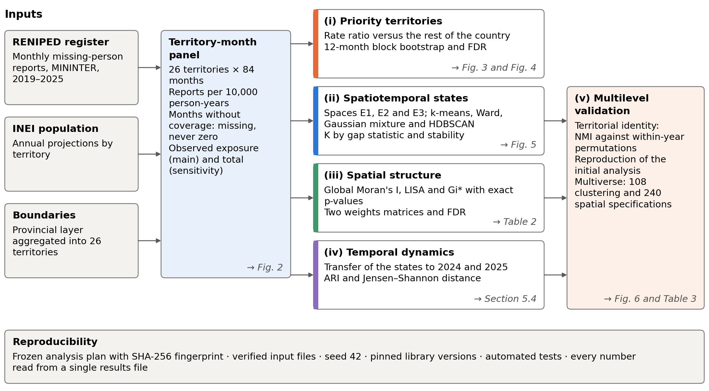
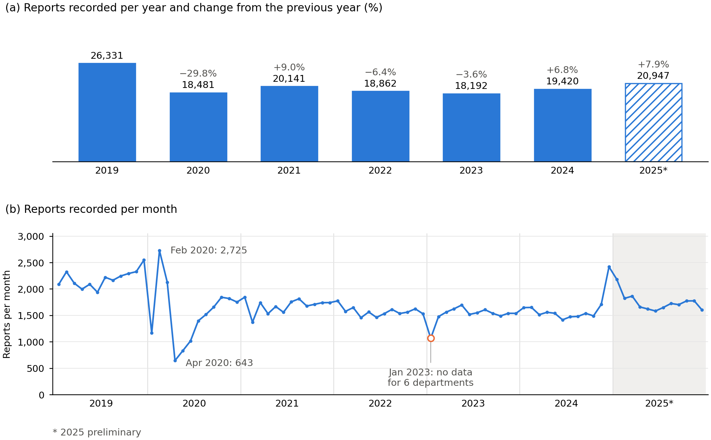
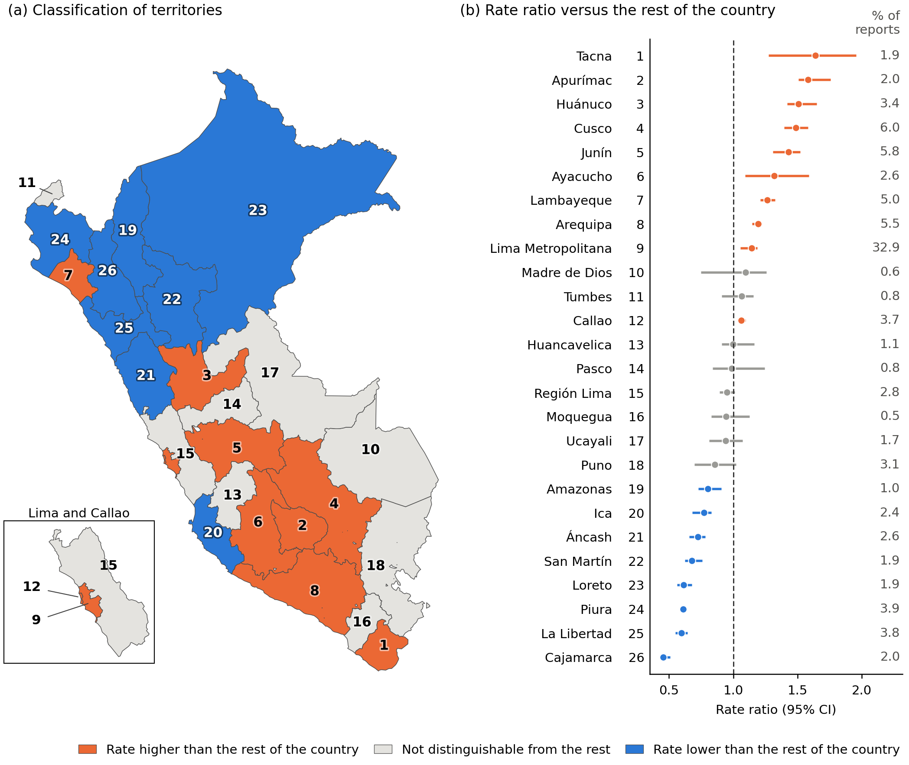
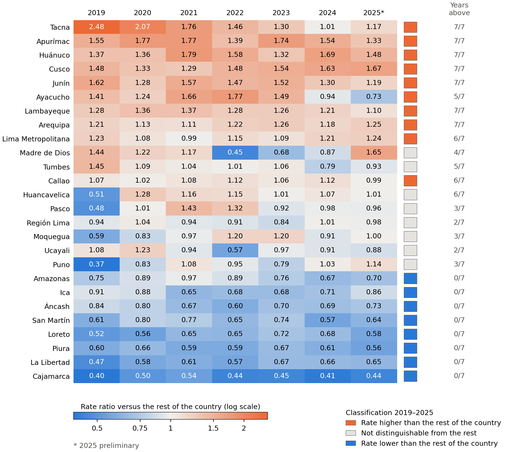
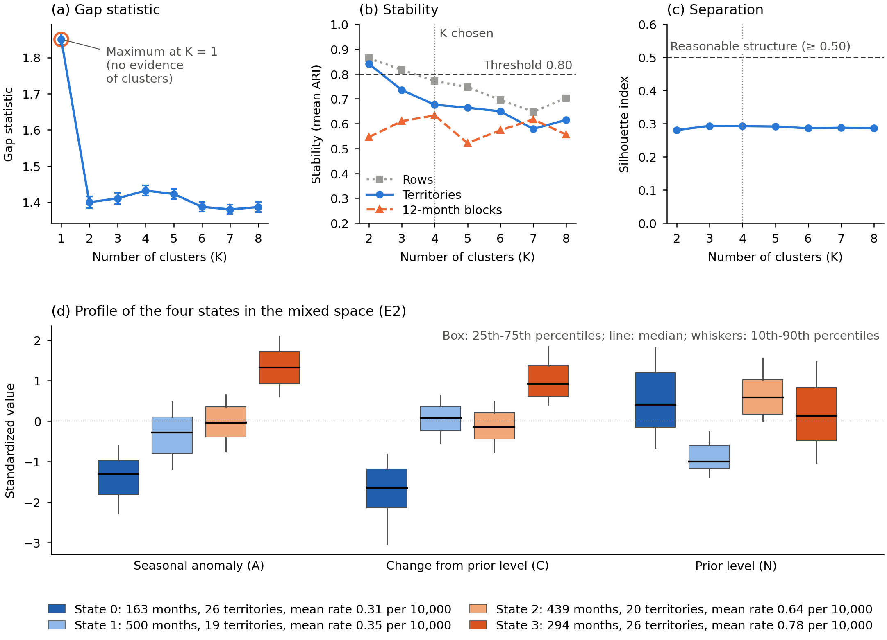
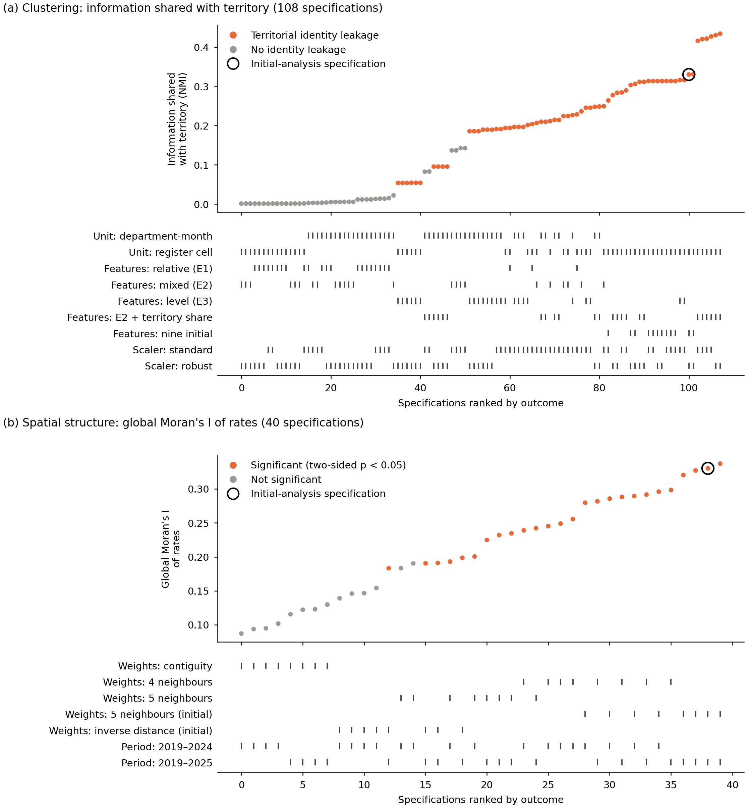

---
# papers/c26-2026/paper/main.qmd
# Single source of the manuscript. Render with:
#   python scripts/paper_build.py --slug c26-2026 --format all
# CI build test — Node.js 24 actions verification
title: "A reproducible GeoAI framework for explainable spatiotemporal analysis of national missing-person registers: multi-algorithm clustering and multilevel validation (Peru, 2019-2025)"
format:
  elsevier-cas-pdf: {}
  elsevier-cas-docx: {}
# journal.* lives at the top level (not under a single format) so that BOTH
# targets see it: the PDF template reads $journal.*$, and cas-docx.lua builds
# the Word front matter (highlights, corresponding/author notes) from it.
journal:
  name: "Information Sciences"
  issn: 0020-0255
  publisher: "Elsevier"
  short-title: "A reproducible GeoAI framework for missing-person registers"
  cite-style: authoryear
  corresponding:
    - mark: cor1
      text: "Corresponding author"
  # Journal requirement: 3-5 highlights x 85 characters.
  highlights:
    - "Ten of 26 Peruvian territories have report rates above the rest of the country"
    - "Metropolitan Lima holds a third of all reports and ranks ninth by rate"
    - "Evidence of spatial association depends on how neighbors are defined"
    - "Four descriptive states summarize monthly profiles"
    - "A specification multiverse quantifies how findings depend on analytical choices"
author:
  - name: Moisés Evangelista Gamarra
    email: mevangelistag@senati.pe
    orcid: "0009-0002-5382-1390"
    affiliation: [{ref: aff-1}]
    cas:
      cormark: 1
      # TODO: confirm the CRediT roles with the authors before submission.
      credit: "Conceptualization, Methodology, Software, Formal analysis, Data curation, Writing - original draft, Visualization"
  - name: Edwar Abrahan Alama Carreño
    email: 1634030@senati.pe
    orcid: "0009-0006-8029-4302"
    affiliation: [{ref: aff-1}]
    cas:
      # TODO: confirm the CRediT roles with the authors before submission.
      credit: "Validation, Investigation, Writing - review & editing"
  - name: Pamela Estefani Figueroa Rosas
    email: 1546935@senati.pe
    orcid: "0009-0007-6100-9382"
    affiliation: [{ref: aff-1}]
    cas:
      # TODO: confirm the CRediT roles with the authors before submission.
      credit: "Supervision, Project administration, Writing - review & editing"
affiliations:
  - id: aff-1
    name: Servicio Nacional de Adiestramiento en Trabajo Industrial (SENATI)
    city: Lima
    country: Perú
abstract: |
  Missing-person report registers describe territorial and temporal patterns whose interpretation must distinguish recorded volume from population frequency. This study develops and applies a reproducible GeoAI framework to the 142,374 reports of Peru's National Registry of Information on Missing Persons (RENIPED, 2019--2025), organized as a panel of 26 territories by 84 months. The framework integrates rates with official denominators, multi-algorithm clustering, spatial association and multilevel validation. Rates ranged from 2.84 to 9.96 reports per 10,000 person-years; ten territories, led by Tacna, Apurímac, Huánuco, Cusco and Junín, had rates above the rest of the country after false discovery rate control, and the classification held in two sensitivity analyses. Metropolitan Lima accounted for a third of the reports, with a rate 14% above the rest of the country. Spatial autocorrelation was significant with the four nearest neighbors (Moran's I = 0.288; p = 0.018) but not with contiguity; after Benjamini--Hochberg adjustment, cold spots were identified in the north and no hot spots. The gap statistic favored a single cluster; four states descriptively summarize monthly profiles. A specification multiverse showed that the clusters and the initial hot-spot corridor depended on specific analytical decisions. The framework provides reproducible quantitative information for institutional search and prevention.
keywords:
  - Missing persons
  - GeoAI
  - Spatiotemporal clustering
  - Spatial autocorrelation
  - Administrative records
bibliography: references.bib
---

# Introduction

The disappearance of people is a humanitarian and public-security problem with profound consequences for families and communities [@icmp2024annual; @icrc2023strategy]. As one of the few systematic sources on the phenomenon, administrative registers of reports are a strategic resource for guiding search, prevention and the allocation of resources, provided that they can answer a concrete question: how does the recorded report rate vary across territories? In Peru, the National Registry of Information on Missing Persons (RENIPED), managed by the National Police [@pnp2026reniped], accumulated 142,374 reports between 2019 and 2025, and its release as open data now makes it possible to address this question at the national scale [@mininter2026denuncias], in a context in which the Ombudsman\'s Office regularly warns about the number of reports of missing women [@defensoria2025quepaso].

Answering this question requires distinguishing the volume of reports from their frequency relative to the population. A densely populated territory can accumulate many records without having the highest rate, whereas a less populated one can record fewer reports and, at the same time, a higher rate. Metropolitan Lima illustrates this tension well: because it concentrates a third of the country\'s reports, it would top any ranking or map of counts. Geospatial artificial intelligence (GeoAI) offers suitable tools for this analysis, from unsupervised clustering of territorial series to spatial association indicators that flag hot and cold spots [@janowicz2020geoaispa; @anselin1995localind; @getis1992theanaly; @ord1995localspa], although its application to missing-person registers is still incipient [@reyes2025whereare; @escobar2026amunicip].

These tools require decisions that can alter the result, such as the unit of analysis, the features, the number of clusters, the spatial weights matrix or the way p-values are computed. The modifiable areal unit problem has already shown that aggregation decisions alone can change spatial conclusions [@openshaw1984maup], and when each decision is made only once it becomes difficult to tell whether a pattern reflects the data or the analytical path chosen to examine them [@gelman2014thestati; @breznau2022observin]. This risk is particularly high in registers organized as panels, which combine few territories with serially correlated months.

The central question of this study is how recorded missing-person report rates are distributed and evolve across Peru\'s territories, which monthly profiles can be described through clustering, and what evidence of spatial association they present. As a complementary dimension, we examine to what extent the interpretation of these patterns holds under different analytical decisions. The general objective is to develop and apply a reproducible GeoAI framework that integrates rate comparison, the characterization of spatiotemporal states and spatial association analysis, together with validation procedures that delimit the scope of its results. To this end, we pose five specific objectives:

- **(i)** to estimate territorial report rates and their ratios to the rest of the country, quantifying their uncertainty and examining their annual persistence;

- **(ii)** to characterize monthly profiles through features of relative behavior and prior level, and to compare the partitions obtained with different clustering algorithms;

- **(iii)** to assess the global and local spatial association of rates, considering alternative neighborhood definitions and adjustment for multiple comparisons;

- **(iv)** to examine the temporal transfer of the states by applying them to subsequent years and comparing them with the partitions obtained in those periods; and

- **(v)** to assess the stability and sensitivity of the findings under resampling, association with territorial identity and a defined set of alternative specifications.

The applied contribution is a joint characterization of the territorial differences, monthly profiles and spatial association of the reports recorded in Peru between 2019 and 2025, which distinguishes how much is recorded in each territory, how frequently relative to its population, how a month behaves relative to its recent history, and whether values are associated with those of neighboring territories. The methodological contribution is an integrated and documented implementation of existing methods that pairs each component with checks of uncertainty, stability or sensitivity, designed to be applied to other administrative registers organized as panels.

# Related work

## GeoAI and missing-person registers

GeoAI combines machine learning with spatial data to describe and predict geographic phenomena [@janowicz2020geoaispa; @vopham2018emerging; @li2024geoaifor]. In public-safety research, a common workflow aggregates records into territory-period panels, clusters them with centroid-based algorithms and maps the resulting states. Missing-person data have entered this field only recently: Ruiz Reyes et al. reviewed the statistical and data-analysis techniques that support the search for missing persons [@reyes2025whereare]; Escobar et al. released a monthly municipality-level panel of disappearance cases and their outcomes in Mexico [@escobar2026amunicip]; and Johnson et al. applied spatial clustering to missing-person records to locate community outreach events [@johnson2025aspatial]. These studies show the value of registers for large-scale analysis and highlight three of their properties: the unit of record is the report, coverage can be interrupted and territorial units are few.

## Rates and the spatial structure of risk

Comparisons among territories of different size rely on per-capita rates. Because rates computed on small populations are more variable, the empirical Bayes adjustment of Assunção and Reis corrects for this difference when measuring autocorrelation [@assuno1999anewprop]. Moran\'s I measures whether neighboring territories tend to have similar rates [@moran1950notesonc]; local indicators of spatial association (LISA) decompose it by territory [@anselin1995localind], and the Getis--Ord G statistics identify concentrations of high or low values [@getis1992theanaly; @ord1995localspa]. Inference for these local statistics relies on conditional randomization, which fixes the value of the territory under evaluation and randomly draws its neighbors\' values from the remaining values [@anselin1995localind]. With few territories, this distribution is discrete: a territory with a single neighbor among 26 admits 25 possible configurations, so its two-sided p-value cannot fall below 2/25 = 0.08. Moreover, because the test is repeated for every territory, a multiple-comparison correction is required, such as the false discovery rate (FDR) control of Benjamini and Hochberg [@benjamini1995controll].

## Clustering and validation of the number of clusters

Internal indices such as the silhouette coefficient [@rousseeuw1987silhouet] summarize how well separated clusters are and are defined for two or more clusters, so the hypothesis of a single cluster lies outside their scope [@kaufman1990findingg]. The gap statistic, by contrast, compares the dispersion of the data with that of structureless reference data and admits a single cluster as a valid answer [@tibshirani2001estimati]. Stability-based validation complements both criteria by assessing whether a partition reappears when the data are perturbed [@lange2004stabilit; @hennig2007clusterw], although its outcome depends on the type of perturbation [@vonluxburg2010clusteri]. In panels, this dependence is decisive: resampling rows treats the months of a territory as independent, whereas block resampling preserves temporal dependence [@kunsch1989thejackk].

## Association between clusters and territorial identity

In supervised learning, information leakage occurs when model development or evaluation uses information that would not be available under the intended conditions of application [@kaufman2012leakagei; @kapoor2023leakagea]. Clustering territorial registers raises a related but distinct issue: features that represent usual levels can produce clusters associated mainly with the territory of origin instead of distinguishing temporal situations shared across territories. Normalized mutual information quantifies this association [@vinh2010information], and its interpretation requires distinguishing persistent territorial differences from properties of the representation used.

## Robustness to analytical decisions

When many teams analyze the same data, their conclusions can differ considerably [@breznau2022observin]. Multiverse analysis [@steegen2016increasi] and specification curve analysis [@simonsohn2020specific] address this problem by evaluating a broad set of combinations of decisions and reporting the full distribution of results. Although these methods have been applied mainly to regression models, this study extends them to clustering and local spatial statistics as part of the validation.

# Data

## The missing-person register

Reports are recorded in the National Police\'s Police Report System (Sistema de Denuncias Policiales, SIDPOL) and consolidated by the General Directorate of Information for Security of the Ministry of the Interior (MININTER), which publishes monthly aggregates on the National Open Data Platform under an ODC-By license [@mininter2026denuncias]. We used the file covering January 2019 to December 2025, whose integrity we verified through its SHA-256 hash (beginning with c41ebcce). The file contains 77,331 rows, each corresponding to a cell defined by the district of occurrence, year, month, age group, sex and nationality, and records a number of reports that together total 142,374.

Three properties of the register condition its interpretation. First, the unit of record is the report rather than the person, so that someone reported more than once is counted more than once, a known feature of police data on missing persons [@james2008missing; @ferguson2022repeator], and each record documents the report, without its outcome. Second, 1,197 rows (1,357 reports) have an unknown age and 83 rows (90 reports) an unknown sex; all were retained without imputation. Third, MININTER describes 2025 as a preliminary year [@mininter2025julio], so 2024 is the last consolidated year. The annual number of reports peaked in 2019 (26,331), fell in 2020 (18,481) and remained between 18,192 and 20,947 from 2021 to 2025.

## Territories and population

Because the register codes the department of occurrence and separates Metropolitan Lima from the rest of the Lima department, we worked with 26 territories: 23 departments, the Constitutional Province of Callao, Metropolitan Lima (Lima Metropolitana, province 150100) and Lima Region (Región Lima, department 150000 minus province 150100). Population data come from the projections of the National Institute of Statistics and Informatics (INEI) at 30 June of each year [@inei2026poblacion], which INEI itself labels as preliminary. Between 2019 and 2025, the 26 territories totaled 233,303,895 person-years.

## Coverage gaps

Eight department-month combinations have no rows in the source. Six correspond to January 2023 (Madre de Dios, Moquegua, Piura, Puno, San Martín and Tacna), a gap consistent with a press release of the Ombudsman\'s Office stating that police statistics as of 13 February 2023 did not include those departments [@defensoria2023enero]; the remaining two correspond to Moquegua in May and June 2020, whose coverage remains unverified. The eight cases were treated as missing data rather than zeros, so that 2,176 of the 2,184 department-months are observed.

We therefore used two definitions of the rate. The main definition divides reports by the person-years of the observed months (observed exposure), whereas the sensitivity definition uses the person-years of all months (total exposure). The national rate was 6.114 reports per 10,000 person-years under the first definition and 6.103 under the second.

The rate measures the frequency of recorded reports relative to the population and observation time of each territory. It is a territorial measure of the administrative register that jointly reflects the occurrence of disappearances and reporting and recording practices, and it is interpreted at the aggregate level, as distinct from the individual probability of disappearance or the proportion of persons who remain missing.

## Panel, temporal splits and geometry

The register was structured as a panel of 26 territories by 84 months that fully preserves the 142,374 reports in the source. For clustering and its temporal validation we defined two splits: in the main split, models are fitted on 2019--2023 and evaluated on 2024; in the secondary split, they are fitted on the consolidated period 2019--2024 and their transfer to 2025 is evaluated. Because the prior level (Section 4.2) requires at least six observed months among the previous 12, the first months of each series do not yield complete features; consequently, the main split contained 1,396 territory-month rows for fitting and 312 rows from 2024 for evaluation.

For the spatial analysis we started from a simplified layer of 197 provinces, derived from INEI census cartography and distributed by a third party [@sanchezrosas2024peru]. Provinces were aggregated into the 26 territories of the panel, and the resulting layer was projected to UTM zone 18 South (EPSG:32718), a metric system suitable for computing distances and neighborhood relations. Under queen contiguity, in which two territories are neighbors if they share a boundary segment or point, each territory had on average 4.15 neighbors (range 1--7). As a sensitivity analysis we used the four nearest neighbors based on great-circle distance computed with the haversine formula.

# Analytical framework

The framework comprises five stages that address objectives (i)--(v): rates and priority territories, spatiotemporal states, spatial structure, temporal dynamics and multilevel validation (Fig. 1). The first four stages start from the same territory-month panel, and the results of stages (ii)--(iv) are tested in the fifth stage through a set of checks and specification curves, so that every finding is accompanied by an assessment of its robustness against reasonable alternatives. To limit analytical flexibility, all parameters are fixed in version 3.3.3 of an analysis plan whose SHA-256 fingerprint is checked at the start of every run, and the plan\'s history documents each change and its rationale, including the addition of the first stage after intermediate results had been reviewed.

We understand the explainability of the framework in an operational sense, as interpretability by design [@rudin2019stopexpl], in contrast to post hoc explanation of black-box models. It rests on three properties: (a) every output is a quantity with a direct meaning, such as a rate ratio with its interval or a state described by its standardized features and its mean rate (Fig. 5d); (b) every analytical decision is explicit, and its influence is quantified in the multiverse through $\eta^2_p$; and (c) every result can be traced to the results file and the code that produces it. User studies and feature-attribution methods lie outside its scope.

{#fig-1}

## Comparison of rates across territories

For each territory *u*, we computed the report rate per 10,000 person-years and compared it with that of the rest of the country, that is, with the pooled rate of the other 25 territories, through the rate ratio:

$$
{RR}_{u} = \frac{{rate}_{u}}{{rate}_{rest(u)}}
$$ {#eq-1}

A rate ratio of 1.5 means that the recorded rate of the territory is 50% higher than that of the other 25 territories combined over the period analyzed. We used the rest of the country as the reference so that each territory is compared with a set that excludes it, which is especially relevant for Metropolitan Lima, whose weight in the national total would pull its comparison with the national mean toward 1.

The uncertainty of *RR*~u~ was estimated with a moving-block bootstrap [@kunsch1989thejackk; @efron1979bootstra] with 9,999 replicates. In each replicate, blocks of 12 consecutive months were drawn with replacement (seven for 2019--2025 and six for 2019--2024), the same for all 26 territories, and the reports and exposure of those months were used to recompute each territory\'s rate, the rate of the rest of the country and their ratio. Each block spans a full annual cycle, and joint resampling preserves the temporal dependence within each block and the correspondence between territories. The 95% confidence intervals are the 2.5th and 97.5th percentiles of the replicates and are individual intervals; multiplicity is controlled in the test described next.

To test *RR*~u~ = 1, we computed approximate two-sided p-values from the bootstrap distribution: we doubled the smaller of two proportions---replicates with a ratio $\le$ 1 and replicates with a ratio $\ge$ 1---each computed as (count + 1)/(9,999 + 1), with a maximum of 1. We then applied the Benjamini--Hochberg procedure to the 26 comparisons [@benjamini1995controll]. A territory was classified as having a **higher** or **lower** rate than the rest when its adjusted p-value (q-value) was below 0.05, according to the direction of the estimated ratio, and as **not distinguishable** when the q-value was 0.05 or higher. As a complementary persistence criterion, we counted in how many of the seven years its annual rate exceeded that of the rest, and we repeated the analysis, as a sensitivity check, for the consolidated period 2019--2024 and with total exposure.

## Features and feature spaces

To describe the monthly evolution of each territory, we constructed the features in Table 1. Let *r*~u,t~ be the monthly report rate of territory *u* in month *t*, that is, the reports recorded divided by the projected population for that year and multiplied by 10,000. To reduce the skewness of its distribution, we used the **transformed monthly rate** *y*:

$$
y_{u,t} = \ln\left( 1 + r_{u,t} \right)
$$ {#eq-2}

The **prior level** *N* summarizes recent history as the mean of *y* over the previous 12 months, excluding the current month, using observed months and requiring at least six:

$$
N_{u,t} = \frac{1}{|M_{u,t}|}\sum_{i \in M_{u,t}}^{}y_{u,t - i}
$$ {#eq-3}

where *M*~u,t~ = {*i* : 1 $\le$ *i* $\le$ 12 and *y*~u,t-i~ observed} is the set of previous months with coverage, and \|*M*~u,t~\| $\ge$ 6 is required. The **change from prior level** *C* is the difference between *y* in the current month and that level: a positive value places the month above its recent history and a negative value below it, both on the transformed scale:

$$
C_{u,t} = y_{u,t} - N_{u,t}
$$ {#eq-4}

Finally, the **seasonal anomaly** *A* compares each month with the mean of the same calendar month in the same territory:

$$
A_{u,t} = \frac{y_{u,t} - \mu_{u,m(t)}}{\sigma_{u}}
$$ {#eq-5}

where $\mu_{u,m(t)}$ is the mean of *y* in the same calendar month and territory (for example, all Januaries) and $\sigma_u$ is the standard deviation of the residuals from those seasonal means, both estimated only with the training years so as not to use information from the future. *A* thus expresses how far a month departs from its seasonal reference in units of the territory\'s residual variability; it is a descriptive measure of seasonal deviation.

With these features we defined three spaces that differ in how much territorial level they contain: the **relative space (E1)**, with *A* and *C*; the **mixed space (E2)**, which is the main space and adds *N*; and the **level space (E3)**, with *y* and *N*. Table 1 summarizes each feature and the spaces in which it is used. The features of each space were standardized with the mean and standard deviation of the training set, and the same parameters were applied to the evaluation observations. This scaling, independent of the territorial normalization of *A*, places the standardized profiles relative to the training distribution.

: Features and feature spaces. {#tbl-1}

| **Feature** | **What it measures** | **Feature spaces** |
| --- | --- | --- |
| Monthly rate (*r*) | Reports per 10,000 inhabitants during the month | Basis of *y* |
| Transformed monthly rate (*y*) | Natural logarithm of 1 + *r* | E3 |
| Prior level (*N*) | Mean of *y* over the previous 12 months, with at least six observed months | E2, E3 |
| Change from prior level (*C*) | Difference between *y* in the current month and *N* | E1, E2 |
| Seasonal anomaly (*A*) | Difference from the seasonal mean of *y*, divided by the territory's residual standard deviation | E1, E2 |
| Territory share of the register (*P*) | Share of reports (panel) or rows (cells) of the territory | Sensitivity specifications only (E2 + *P*) |

The spaces therefore form a gradient: E1 describes each month only relative to its own territory, whereas E2 and E3 progressively add the usual level of the territory, which makes it possible to assess how much of the resulting states reflects territorial identity (Section 5.5).

## Multi-algorithm clustering and choice of K

We clustered the months of each territory with k-means for *K* = 2 to 8 clusters, implemented in scikit-learn [@pedregosa2011scikit] (seed 42; 10 initializations during the selection of *K* and 20 in the final partitions). To assess how much the states depend on the algorithm, we also fitted Ward\'s hierarchical clustering, a Gaussian mixture model and HDBSCAN [@campello2013densityb], and compared their partitions with that of k-means using the adjusted Rand index (ARI), which equals 1 when two partitions coincide and is close to 0 when they agree only by chance [@hubert1985comparin]. Clusters were numbered by their mean monthly rate, from lowest to highest, so that state 0 is always the lowest.

The evaluation distinguished between evidence of cluster separation and the selection of a partition to describe the data. For the former, we computed the gap statistic from *K* = 1, with 100 reference samples and Tibshirani\'s one-standard-error rule [@tibshirani2001estimati]. For the latter, we evaluated partitions with *K* = 2 to 8 by their stability, measured as the mean ARI over 100 resamples of whole territories and of 12-month blocks; row resampling is reported for comparison only. Candidates were the values of *K* with a mean ARI of at least 0.80 under both schemes, a threshold adopted as an operational criterion; among them, the rule chose the *K* given by the gap rule applied from *K* = 2 or, if that value was not a candidate, the one with the highest silhouette. If no *K* reached the threshold, a fallback rule chose the partition with the highest minimum stability across both schemes (the smallest *K* in case of ties), which is used as a descriptive summary. We also report the silhouette and the Davies--Bouldin [@davies1979acluster] and Calinski--Harabasz [@caliski1974adendrit] indices.

## Spatial association analysis

We measured the global autocorrelation of the 2019--2025 rates with Moran\'s I [@moran1950notesonc], with 9,999 permutations and two-sided p-values. To assess the robustness of the pattern we repeated the computation (a) with the consolidated period 2019--2024, (b) with the empirical Bayes adjustment, which stabilizes the variance of rates in sparsely populated territories [@assuno1999anewprop], (c) with report counts and (d) with the proportion of months that each territory spent in the highest-rate state. A leave-one-out analysis also recomputed the index after removing each territory. At the local level we computed the Getis--Ord Gi\* statistic [@getis1992theanaly; @ord1995localspa] and the local Moran\'s I [@anselin1995localind] with PySAL [@rey2007pysalapy].

For the main local analyses, with contiguity and with the four nearest neighbors, we obtained p-values by exact conditional randomization. With the value of the territory evaluated and its number of neighbors fixed, we enumerated all combinations of values that could occupy the neighboring positions among the other 25 territories; with the uniform weights used, both statistics depend only on the sum of those values. The two-sided p-value doubles the smaller of the proportions of combinations whose sum is greater than or equal to, or less than or equal to, the observed sum, with a maximum of 1, and in the absence of ties its smallest attainable value is:

$$
p_{\min} = \frac{2}{C(25,k)} = \frac{2 \cdot k! \cdot (25 - k)!}{25!}
$$ {#eq-6}

where C(25, *k*) is the number of ways of choosing *k* neighbors out of 25. For a territory with a single neighbor, *p*~min~ = 2/25 = 0.08, so local significance at 5% for Callao and Tumbes under contiguity lies beyond the resolution of the test; we therefore report this minimum for each territory. When the combinations exceeded one million, we used 99,999 random draws with a fixed seed. We controlled the FDR across the 26 territories with the Benjamini--Hochberg procedure, and we also report uncorrected results and, as a sensitivity check, results with the Benjamini--Yekutieli procedure, which is valid under any form of dependence among the tests [@benjamini2001thecontr]. Exact enumeration removes sampling variability, and the fixed seed makes the approximate computations reproducible.

## Temporal transfer of the states

Temporal transfer was assessed by applying the model fitted in the training period to the observations of the following year. On the same observations, we refitted k-means with the same number of states and compared both assignments with the ARI; the refitted partition serves as an internal reference, so the ARI measures the agreement between both assignments. We also compared the proportion of observations in each state between training and the evaluation year with the base-2 Jensen--Shannon distance [@lin1991divergen; @endres2003anewmetr], which ranges from 0 to 1 and summarizes changes in the distribution of states.

## Design of the multilevel validation

The last stage assesses the robustness of the previous patterns to analytical decisions at three complementary levels.

**Association with territorial identity.** This evaluation examines the extent to which the states obtained are linked to the territory from which the observations come. To this end, we computed the normalized mutual information (NMI) between states and territories [@vinh2010information] and the fraction of the uncertainty about the state that is removed by knowing the territory:

$$
U = 1 - \frac{H(G \mid T)}{H(G)}
$$ {#eq-7}

where *H*(*G* \| *T*) is the entropy of the states conditional on the territory and *H*(*G*) is the entropy of the partition. A value of *U* = 0.25 means that knowing the territory removes a quarter of the uncertainty about the state; it is a measure of shared information. The observed NMI was compared with a reference distribution of 999 permutations that, within each year, randomly reassign territorial identities using the same reassignment for all months of each territory, which preserves the sequences within each year but breaks the territorial correspondence across years. We call **identity leakage** the operational signal defined by p \< 0.05 and *U* $\ge$ 0.25, an operational criterion defined in the analysis plan to compare specifications.

**Reproduction of the initial analysis (baseline).** To obtain a reference point, we reproduced an initial analysis of these data conducted by the authors in a conventional way. That analysis clustered the register cells into three states with nine features, robust scaling and the maximum-silhouette rule, and it reported a southern Andean corridor of hot spots using five nearest neighbors on hand-digitized centroids, one-sided p-values and no multiple-comparison correction.

**Multiverse.** To examine the sensitivity of the conclusions to analytical decisions, we evaluated a set of specifications defined in the analysis plan [@steegen2016increasi; @simonsohn2020specific]. The clustering multiverse (M1) crossed the unit of analysis (panel or cell), the trimming of extreme values, the feature space (E1, E2, E3, E2 plus territory share and, for cells, the nine initial features), the scaling and the rule for choosing *K*, for a total of 108 specifications. To keep execution feasible, M1 used a reduced budget: 20 resamples, five initializations, *K* between 2 and 6, 199 permutations for the null distribution, silhouettes on 5,000 rows and, as in the initial analysis, a subsample of 20,000 cells. The spatial multiverse (M2) crossed the trimming of extremes, the period, the variable (two rates or the count), five neighborhood matrices (including the two of the initial analysis), the p-value type (one- or two-sided) and the multiple-comparison correction, for a total of 240 specifications. In each specification we evaluated claims defined in the plan, such as "there is structure according to the silhouette ($\ge$ 0.50)", "there is identity leakage" or "there is a southern Andean hot spot", the latter met when at least one of the five territories of the initial corridor (Arequipa, Ayacucho, Cusco, Moquegua and Tacna) is a hot spot (Puno, a sixth hot spot in the reproduction, lies outside that definition). The support of each claim is the proportion of specifications that meet it, and partial eta squared ($\eta^2_p$) ranks the relative importance of each decision within the design.

## Reproducibility

The procedure was implemented in Python as a modular package, accompanied by a Google Colab notebook and ten automated tests of its critical components. The version analyzed (3.3.3) fixes all decisions in a versioned analysis plan whose history documents each change and its rationale. All random operations use seed 42, each input file is identified by its SHA-256 hash, and every analytical result is read from a single results file, from which the figures are also generated. The reference run on Google Colab (two processors; Python 3.13, NumPy 2.1.3, scikit-learn 1.6.1 and esda 2.9.0) took 30 minutes. A new full run on another computer, from the same input files and with the same versions, reproduced 34 of the 35 tables with relative differences below $10^{-10}$; the remaining table differed only in internal HDBSCAN indices outside the results of the article.

# Results

## Territorial differences in rates

Between 2019 and 2025 the register recorded 142,374 reports, with an annual peak in 2019 and values between 18,192 and 20,947 from 2021 onward (Fig. 2). The report rate varied 3.5-fold across territories, from 2.84 per 10,000 person-years in Cajamarca to 9.96 in Tacna (Fig. 3). Ten territories had a rate higher than that of the rest of the country, eight had a lower rate and eight were not distinguishable from the rest, a classification that remained exactly the same under both sensitivity analyses, with the consolidated period 2019--2024 and with total exposure.

{#fig-2}

Five territories in the center and south of the country topped the list: Tacna (*RR* = 1.64; 95% CI: 1.27--1.96), Apurímac (1.58; 1.51--1.76), Huánuco (1.51; 1.42--1.65), Cusco (1.49; 1.40--1.58) and Junín (1.43; 1.31--1.52). In all of them, the annual rate exceeded that of the rest of the country in each of the seven years of the study (Fig. 4). They were followed by Ayacucho (1.32; 1.09--1.59; five of seven years), Lambayeque (1.26) and Arequipa (1.20), the latter two also above the rest in all seven years, and then by Metropolitan Lima (1.14) and Callao (1.06).

Metropolitan Lima clearly illustrates the difference between volume and intensity: it ranked first in number of reports (46,848, or 33% of the national total) and ninth by rate (6.70), with an excess over the rest of the country of 14% (*RR* = 1.14; 95% CI: 1.05--1.19) that recurred in six of the seven years, that is, a moderate and persistent excess. Callao, with a rate of 6.48, showed an excess of 6%.

At the opposite end, the eight territories with lower rates were Cajamarca (*RR* = 0.45), La Libertad (0.59), Piura (0.61), Loreto (0.61), San Martín (0.68), Áncash (0.73), Ica (0.77) and Amazonas (0.80), all below the rest of the country in each of the seven years, and six of them (Amazonas, Cajamarca, La Libertad, Loreto, Piura and San Martín) are located in the north. The territories that were not distinguishable include some with wide intervals owing to their smaller populations, such as Madre de Dios (1.10; 0.75--1.26) and Pasco (0.99; 0.84--1.24), and others whose rates are close to that of the rest, such as Moquegua (0.94) and Puno (0.86).

{#fig-3}

Fig. 4 breaks the classification down by year, which makes it possible to distinguish a persistent excess from one concentrated in a few years. Apurímac, Huánuco, Cusco and Junín remained between 1.19 and 1.79 in every year, and the excess of Cusco grew from 1.29 in 2021 to 1.67 in 2025. In Tacna, the excess declined steadily from 2.48 in 2019 to 1.01 in 2024 and rebounded slightly in 2025 (1.17), so its first place is driven mainly by the early years of the period. Ayacucho exceeded the rest until 2023 and fell below it in 2024 (0.94) and 2025 (0.73). Territories with lower rates remained so consistently; Cajamarca, for example, ranged from 0.40 to 0.54, whereas among the non-distinguishable territories Madre de Dios fluctuated between 0.45 and 1.65, which explains the width of its interval. These annual ratios are descriptive; the classification is based on the full period.

{#fig-4}

## Monthly profiles of the states

In the mixed space E2, the three diagnostics agreed on weak separation between clusters (Fig. 5a--c). The gap statistic peaked at *K* = 1 (1.851, compared with 1.380--1.432 for *K* = 2--8), the silhouette remained between 0.28 and 0.29, and minimum stability stayed below 0.80 for all partitions. The fallback rule selected *K* = 4, the partition with the highest minimum stability (0.63), which we use to summarize monthly profiles. Agreement with other algorithms was low: the ARI with respect to k-means was 0.31 for Ward and 0.23 for the Gaussian mixture, and HDBSCAN labeled 70% of the observations as noise.

The profile of the four states reveals that they combine two types of difference (Fig. 5d). Two of them describe the dynamics of the month and appear in all 26 territories: state 0 gathers 163 months well below the usual level, with a mean seasonal anomaly of -1.40 residual standard deviations of the territory (SD = 0.64) and a mean monthly rate of 0.31 per 10,000 inhabitants (SD = 0.16), and state 3 gathers 294 months above the usual level, with an anomaly of +1.21 (SD = 0.55) and a rate of 0.78 (SD = 0.29). The other two group months with anomalies close to zero (-0.38 and -0.11) and differ mainly in the level of the territory: state 1 (500 months from 19 territories) corresponds to territories with a low prior level, with a standardized median of -1.00, and state 2 (439 months from 20 territories) to territories with a high level, with a median of 0.59. This composition explains why, as shown in Section 5.5, the states share information with territorial identity.

{#fig-5}

## Autocorrelation and local concentrations

Table 2 reports the global Moran's I of the 2019--2025 rates and of the alternative variables under the two main neighborhood definitions, with the two-sided permutation p-value in parentheses.

: Global spatial autocorrelation. {#tbl-2}

| **Variable and period** | **Contiguity: I (p)** | **Four nearest neighbors: I (p)** |
| --- | :---: | :---: |
| Rate, observed exposure, 2019--2025 | 0.122 (0.244) | 0.288 (0.018) |
| Rate, total exposure, 2019--2025 | 0.116 (0.260) | 0.282 (0.020) |
| Empirical Bayes rate, 2019--2025 | 0.122 (0.244) | 0.288 (0.018) |
| Rate, observed exposure, 2019--2024 | 0.094 (0.325) | 0.245 (0.032) |
| Report count, 2019--2025 | -0.008 (0.537) | -0.004 (0.451) |
| Proportion of months in the high state, 2019--2023 | -0.104 (0.663) | 0.014 (0.589) |

Global spatial autocorrelation of the rates was positive, and its significance depended on the neighborhood definition. With the four nearest neighbors, Moran\'s I was 0.288 (p = 0.018) for 2019--2025 and 0.245 (p = 0.032) for 2019--2024; under contiguity it was 0.122 (p = 0.244), against an expected value of -0.04 in the absence of autocorrelation, and the empirical Bayes adjustment reproduced these values. The positive association therefore holds under nearest-neighbor proximity. Counts and the proportion of months in the highest-rate state had I values between -0.10 and 0.01, not significant with either matrix. When each territory was removed in turn (24 computable exclusions), Moran\'s I under contiguity ranged from 0.029 to 0.289 and was significant only when Huánuco was excluded, which indicates sensitivity to the territorial composition.

At the local level, Table 3 lists the territories whose Gi\* statistic remained significant after Benjamini--Hochberg adjustment (q < 0.05), where *z* is the standardized Getis--Ord statistic, q the adjusted p-value and the LISA type compares the value of each territory with those of its neighbors.

: Local concentrations retained after false discovery rate control. {#tbl-3}

| **Territory** | **Matrix** | **Gi\* z** | **Exact p** | **q (FDR)** | **LISA type** |
| --- | --- | :---: | :---: | :---: | --- |
| Amazonas | Contiguity | -3.01 | 0.0003 | 0.008 | Low-low |
| Lambayeque | Contiguity | -1.95 | 0.002 | 0.023 | High-low |
| Lambayeque | 4 neighbors | -2.12 | 0.002 | 0.037 | High-low |
| San Martín | 4 neighbors | -2.84 | 0.003 | 0.037 | Low-low |

Benjamini--Hochberg adjustment identified cold spots in Amazonas and Lambayeque under contiguity, and in Lambayeque and San Martín with four neighbors; under the more conservative Benjamini--Yekutieli adjustment, Amazonas remained significant (q = 0.032). After adjustment, no territory was a hot spot with either main matrix. The highest positive Gi\* values corresponded to Apurímac, Cusco and Ayacucho under contiguity (*z* between 2.13 and 2.43; two-sided p between 0.057 and 0.064), and Metropolitan Lima had a value close to zero (*z* = 0.07; p = 0.97).

The local classification differs from the comparison of each territory with the rest of the country. Lambayeque has a rate above that of the rest (Section 5.1) and, at the same time, a low-value surrounding that Gi\* identifies as a cold spot, whereas the local Moran\'s I characterizes it as a high-value territory surrounded by low values; both readings describe different aspects of its spatial position.

## Changes in the states across years

In 2024, the partition transferred from the 2019--2023 fit had an ARI of 0.41 with respect to the partition refitted in that year; the proportion of observations in state 1 rose from 35.8% during training to 56.4%, and the Jensen--Shannon distance between the state distributions was 0.18. In 2025, with the model fitted up to 2024, the ARI was 0.52 and the distance 0.05, with proportions close to those of training. These results indicate partial temporal agreement, so the states vary across periods.

## Sensitivity of the findings

**Association with territorial identity.** Table 4 compares, for each feature space, the normalized mutual information (NMI) between states and territories with the 95th percentile of its permutation distribution; the entropy fraction is the share of the uncertainty about the state that is removed by knowing the territory (*U*, Section 4.6).

: Association between states and territorial identity by feature space. {#tbl-4}

| **Feature space** | **NMI** | **Null threshold (p95)** | **p-value** | **Entropy fraction** |
| --- | :---: | :---: | :---: | :---: |
| Relative (E1) | 0.015 | 0.021 | 0.813 | 0.027 |
| Mixed (E2) | 0.138 | 0.065 | 0.001 | 0.240 |
| Level (E3) | 0.252 | 0.116 | 0.001 | 0.453 |

The information shared between states and territories increased as the features incorporated territorial level. In the relative space (E1), the NMI was 0.015, within what chance would produce (p = 0.81); in the mixed space (E2) it rose to 0.138 (p = 0.001), with 24% of the clusters\' entropy explained by territory, just below the 0.25 threshold; and in the level space (E3) it reached 0.252, with 45% of the entropy explained and three territories whose months almost always fell in the same cluster. Requiring 12 months of history instead of 6 preserved the same ordering among spaces (NMI of 0.026, 0.166 and 0.271), and with that requirement E2 exceeded the leakage threshold (fraction 0.29).

**Reproduction of the initial analysis.** The framework reproduced the initial analysis: with register cells, nine features, robust scaling and the maximum-silhouette rule, it selected three clusters with a silhouette of 0.559 (0.550 in the initial report), and with its weights matrix it obtained a Moran\'s I of 0.330 and six hot spots (Arequipa, Ayacucho, Cusco, Moquegua, Puno and Tacna). That partition shared a great deal of information with territory (NMI of 0.330; in 12 of the 26 territories, at least 95% of the cells fell in a single cluster), and with standard scaling the same specification selected two clusters, with each territory falling entirely in one of them. The three initial clusters thus described mainly differences in territorial size and identity.

**Multiverse.** Table 5 reports the support of each claim defined in the plan, that is, the percentage of the specifications indicated in which it holds.

: Support for the claims evaluated in the multiverse. {#tbl-5}

| **Claim** | **Specifications** | **Support** |
| --- | :---: | :---: |
| Structure according to the silhouette ($\ge$ 0.50) | 108 | 34.3% |
| Structure stable under row resampling | 108 | 97.2% |
| Structure stable under territory and block resampling | 108 | 30.6% |
| Territorial identity leakage | 108 | 62.0% |
| Global autocorrelation of rates | 160 | 72.5% |
| Southern Andean hot spot (one-sided p, uncorrected) | 40 | 100% |
| Southern Andean hot spot (two-sided p and FDR) | 40 | 0% |
| Hot spot in Metropolitan Lima | 240 | 0% |

Across the 108 clustering specifications, row resampling indicated stability in 97% of cases, compared with 31% when territories and blocks were resampled; the silhouette exceeded 0.50 in 34%, and 62% showed identity leakage according to the operational criterion of Section 4.6 (Fig. 6a). Within the set evaluated, the feature space was the decision most associated with differences in NMI ($\eta^2_p$ = 0.60), and scaling and the unit of analysis were the most associated with differences in silhouette ($\eta^2_p$ = 0.37 each).

In the 160 spatial rate specifications, Moran\'s I was significant in 72.5% (65% with two-sided p-values), never under contiguity and, with two-sided p-values, in 50--100% of the specifications with the other four matrices (Fig. 6b). The southern Andean hot spot appeared in all specifications with uncorrected one-sided p-values, and in 0% with two-sided p-values and FDR control. In the latter scenario, only the inverse-distance matrix of the initial analysis flagged hot spots (8 of 40 specifications: Apurímac, Madre de Dios and Puno), with local p-values obtained by random draws because that matrix assigns each territory between 6 and 18 neighbors. Metropolitan Lima was not a hot spot in any of the 240 spatial specifications.

Fig. 6 summarizes both validations through specification curves. Each point represents a specification, ordered by the value of the metric, and the lower marks identify the options used; their concentration in one sector of the curve signals an association between the decision and the result. In panel (a), 39 of the 41 specifications without identity leakage use relative (E1) or mixed (E2) features, and the remaining two use the mixed space with territory share; the specifications with the nine features of the initial analysis are among those with the highest NMI (0.26--0.33). In panel (b), contiguity occupies the eight lowest positions, whereas the five-neighbor matrix of the initial analysis sits at the top. The figure shows the most influential decisions; the others have a smaller effect (in panel a, the rule for choosing *K*, $\eta^2_p$ = 0.10, and winsorization, $\eta^2_p$ \< 0.01; in panel b, exposure and winsorization, which change the mean Moran\'s I by less than 0.01).

{#fig-6}

# Discussion

## Implications for search and prevention

The result with the broadest policy relevance is the classification in Fig. 3. Ten territories have report rates above the rest of the country after FDR control, and five of them (Tacna, Apurímac, Huánuco, Cusco and Junín) exceed it by 43% to 64% over the full period, with an annual rate above that of the rest in each of the seven years. The agreement of this classification across the two sensitivity analyses supports its consistency under the variations in period and exposure examined. These results provide one quantitative criterion for assessing needs for search, prevention and review of the register; allocating resources requires combining it with the volume of reports, the status of cases and institutional response capacity. Fig. 4 adds a useful nuance for planning: Apurimac, Huánuco, Cusco and Junín maintained rates higher than those of the rest of the country during the seven years, that of Cusco is increasing, and that of Tacna declined until approaching the rate of the rest of the country in 2024 (RR = 1.01) and rebounded only slightly in 2025. The classification should therefore be updated every year rather than being based only on the period average.

Metropolitan Lima illustrates the value of considering the volume and the rate of reports together: the count describes the magnitude of recorded activity, whereas the rate places that volume in relation to the population and allows comparison with other territories. An institutional assessment of priorities should combine both dimensions with information on pending cases, their urgency and the available resources, aspects that lie beyond the scope of this study.

The low rates in the north admit several explanations: fewer disappearances, poorer access to police stations, a lower willingness to report or differences in recording. The available data describe the pattern, and attributing causes requires additional information; the same applies to high rates, which indicate where more reports are filed per inhabitant.

## Interpreting the spatial pattern and the states

High-rate territories are concentrated in the center and south of the country, and the inferential evidence specifies the scope of this concentration: global autocorrelation is significant with the four nearest neighbors, and multiple-comparison adjustment retained no hot spots with the main matrices. The results are consistent with a regional concentration of high rates, detectable under nearest-neighbor weights, and do not confirm a hot-spot corridor under the main specifications. The smallest attainable p-value limits local significance only for Callao and Tumbes under contiguity; for the southern territories with the highest Gi\* values that minimum was below 0.001, and the power of the test was not formally assessed. In the north, the cold spots identified with Benjamini--Hochberg varied with the matrix, and Amazonas remained significant under Benjamini--Yekutieli.

The four states serve a descriptive purpose: they summarize combinations of seasonal anomaly, change from prior level and usual level, and they distinguish relatively low or high months from situations linked to persistent differences between territories. Given the weak separation of the partitions, their boundaries are interpreted as analytical approximations. Rate classification and clustering also answer different questions and complement each other: the former compares the recorded frequency over the full period, with a classification that was identical in two sensitivity analyses, and the latter describes monthly dynamics.

## Lessons for the analysis of administrative registers

Multilevel validation helps to interpret the differences between the initial analysis and the alternative specifications. The initial clusters showed greater separation and stability under particular choices of unit of analysis, features and resampling, and their association with territorial identity indicated that part of that organization was linked to persistent differences between territories. This result points the interpretation of the initial clusters toward persistent territorial differences rather than shared temporal states. Likewise, the identification of the southern Andean corridor changed when the sidedness of the test and the multiple-comparison adjustment were modified. Together, these results show the need to assess which conclusions hold under alternative analytical decisions.

Building on this experience, we recommend five checks for similar analyses: compare rates rather than counts, always with their uncertainty; evaluate the gap statistic starting from a single cluster; measure stability by resampling territories and time blocks; compute exact local p-values and report the minimum attainable p-value of each territory; and control the FDR with more than one weights matrix.

## Limitations

The study relies on an aggregated administrative register. Because the register identifies neither unique persons nor the outcome of cases, rates describe the recorded frequency at the territorial level, and differences between territories combine the occurrence of the phenomenon with access to reporting and recording procedures. Population projections and the 2025 records are preliminary, and observed exposure corrects the denominator of the eight territory-months without information, whose reports remain absent. Aggregation into 26 territories also places the results at the departmental scale.

Methodologically, the spatial findings depend on the neighborhood definition and on the multiple-comparison adjustment, and the geographic layer, distributed by a third party, requires comparison with official cartography. The intervals of the rate ratios rely on fixed-length blocks over seven years and reflect the temporal variability of the register, without incorporating under-reporting or the uncertainty of the projections. The states depend on the representation of the features, and the association with territorial identity was assessed with a specific annual permutation scheme; the temporal evaluation, limited to two years, measures agreement between partitions.

Finally, the framework was evaluated on a single register, without synthetic data of known structure, and the multiverse covers a finite set of decisions with a reduced computational budget. The territorial rate comparison was added to the plan after intermediate results were reviewed, as documented in its history, so that component has an exploratory character. Its application in other contexts requires checking coverage, units of analysis and the assumptions of each method.

## Future work

The study can be extended in three directions: evaluating a finer territorial scale, after checking coverage, denominators and the stability of rates in small areas; applying the procedure to other administrative registers to examine which components hold and which require adaptation; and running experiments with synthetic data representing temporal dependence, persistent territorial differences, coverage gaps and known spatial concentrations, in order to assess the calibration of the tests and the framework\'s ability to distinguish known patterns from variations introduced by analytical decisions.

# Conclusions

This study integrated population rates, clustering and spatial analysis to characterize the 142,374 missing-person reports recorded in Peru between 2019 and 2025. Rates ranged from 2.84 to 9.96 reports per 10,000 person-years, and ten territories, led by Tacna, Apurímac, Huánuco, Cusco and Junín, had rates above the rest of the country, with a classification that held in both sensitivity analyses. Metropolitan Lima accounted for a third of the reports without having the highest rate, which shows the value of considering the recorded volume and its relation to the population together.

Spatial evidence depended on the neighborhood definition: global autocorrelation was significant with the four nearest neighbors and, after Benjamini--Hochberg adjustment, the main matrices identified cold spots in the north and no hot spots. In the clustering component, the diagnostics showed weak separation between clusters, and the four selected states summarize monthly profiles whose interpretation takes into account territorial association and the partial agreement between periods.

The contribution of the framework lies in articulating these perspectives and pairing them with checks that delimit the interpretation of the results. The findings provide quantitative information for assessing institutional needs, in combination with the status of cases and the available response capacity. The code, the analysis plan and the results are published to facilitate their verification; their extension to other registers requires validating the conditions of application and the behavior of the procedures used.

